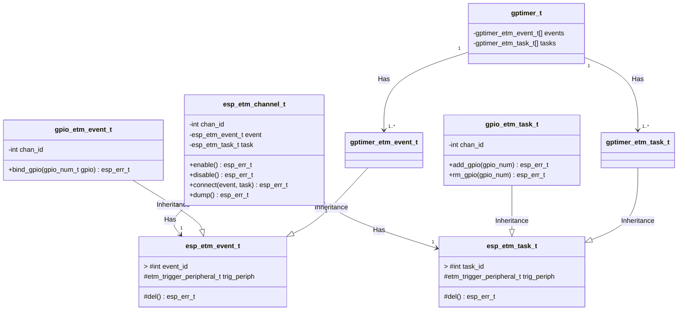

# Research: fiberquest-esp32p4-capabilities

**Date:** 2026-03-05  
**Status:** AUTO-CRAWLED (Gemini gemini-2.5-flash)  
**Seeds:** https://www.espressif.com/en/news/ESP32-P4, https://raw.githubusercontent.com/espressif/esp-idf/master/components/esp_hw_support/README.md, https://github.com/espressif/esp-idf/tree/master/examples/peripherals/usb/host, https://www.espressif.com/sites/default/files/documentation/esp32-p4_datasheet_en.pdf

---

## Research Note: fiberquest-esp32p4-capabilities

**Date:** 2026-03-05

### Summary
The ESP32-P4 is a highly capable SoC for a console connectivity hub, offering significant advantages over previous Espressif chips, particularly the ESP32-S3, for this application. Its dual-core 400MHz RISC-V CPU, combined with 768KB on-chip SRAM and support for large external PSRAM, provides ample processing power and memory for buffering game states and complex protocol emulation. Key features like USB 2.0 HS OTG (480Mbps) and over 50 programmable GPIOs are critical for interfacing with both modern USB controllers and older, custom console protocols. The presence of an LP-Core, 8KB TCM RAM, and the Event-Task Service (ETM) in ESP-IDF indicate strong real-time capabilities for precise microsecond-level timing.

### 1. CPU: dual-core RISC-V P4 at 400MHz — how does this compare to ESP32-S3 for real-time protocol emulation? Is 400MHz enough for bit-banging SNES link at the right timing?

The ESP32-P4 features a dual-core RISC-V CPU running up to 400MHz, with single-precision FPU and AI extensions, and an additional LP-Core running up to 40MHz for ultra-low-power applications. (Source: Espressif Reveals ESP32-P4 News)

**Comparison to ESP32-S3:** The provided content does not explicitly detail the ESP32-S3's CPU specifications for a direct comparison. However, the ESP32-P4's 400MHz clock speed is generally higher than the ESP32-S3's typical 240MHz, offering more raw computational power. For real-time protocol emulation, the P4's higher clock speed provides greater headroom.

**400MHz for bit-banging SNES link:** Yes, 400MHz is more than sufficient for the raw processing speed required for bit-banging SNES link protocols. SNES controller communication typically operates at relatively low speeds (e.g., ~120kHz for data clock). The challenge in bit-banging is not raw CPU speed but precise timing and low interrupt latency. The ESP32-P4's architecture, including its 8KB of zero-wait TCM RAM for time-critical code and the Event-Task Service (ETM) (see Q5), is well-suited to handle microsecond-level timing requirements for such protocols.

### 2. Memory: 768KB SRAM + external PSRAM support up to 32MB — enough to buffer game states from multiple consoles simultaneously?

The ESP32-P4 HP core system has 768KB of on-chip SRAM and 8KB of zero-wait TCM RAM. It also supports external PSRAM and Flash. (Source: Espressif Reveals ESP32-P4 News) The research topic specifies "external PSRAM support up to 32MB."

**Buffering game states:** Yes, 768KB of on-chip SRAM, complemented by up to 32MB of external PSRAM, is a substantial amount of memory for an MCU.
*   **768KB SRAM:** This is large enough to buffer several game states from older consoles (e.g., NES, SNES, Genesis), which typically have state sizes in the tens to hundreds of kilobytes.
*   **32MB external PSRAM:** This provides significant capacity to buffer multiple full game states simultaneously, even for more complex older systems, or to store larger datasets. The 8KB TCM RAM is ideal for critical, low-latency data access.

### 3. Peripherals: USB 2.0 HS OTG (480Mbps), MIPI CSI/DSI, SDIO, I2S, SPI x3, UART x3 — which of these map to console protocols? USB HS could connect directly to modern USB controllers/adapters.

The ESP32-P4 supports a wide range of peripherals, including USB OTG 2.0 HS, Ethernet, SDIO Host 3.0, SPI, I2S, I2C, LED PWM, MCPWM, RMT, ADC, DAC, and UART. (Source: Espressif Reveals ESP32-P4 News)

**Mapping to console protocols:**
*   **USB OTG 2.0 HS (480Mbps):** This is highly relevant. It can directly connect to and act as a host for modern USB controllers (e.g., Xbox, PlayStation, Switch Pro controllers) or USB-to-console adapters. The `esp-idf/examples/peripherals/usb/host` directory confirms USB host capabilities within the ESP-IDF framework.
*   **SPI (x3):** Many older console accessories and link cables (e.g., Game Boy Link Cable, some memory card interfaces) utilize SPI-like serial protocols.
*   **UART (x3):** Standard serial communication, used by some older consoles for link cables, debugging, or specific accessories.
*   **I2S:** Primarily for audio input/output, potentially useful for capturing or generating console audio signals.
*   **RMT (Remote Control Peripheral):** The RMT peripheral is excellent for generating and receiving precise pulse trains, which are fundamental to many classic console controller protocols (e.g., NES, SNES, N64, GameCube controllers often rely on specific pulse widths and timings).
*   **GPIO (see Q4):** Essential for bit-banging custom serial or parallel protocols that don't fit standard peripheral interfaces, or for direct control of multiple signal lines.

### 4. GPIO: how many available for parallel console port emulation?

The ESP32-P4 has "more than 50 programmable GPIOs, which is significantly more than those of any other Espressif SoC to date." (Source: Espressif Reveals ESP32-P4 News)

**Parallel console port emulation:** With over 50 programmable GPIOs, the ESP32-P4 offers substantial flexibility. A typical parallel port might require 8 data lines plus several control lines (e.g., 12-16 pins total). This high GPIO count makes it feasible to:
*   Emulate multiple parallel console ports simultaneously.
*   Dedicate a large number of pins to complex multi-pin interfaces.
*   Support numerous bit-banged serial interfaces concurrently.

### 5. Real-time: does ESP32-P4 support real-time priority tasks suitable for microsecond-level protocol timing?

Yes, the ESP32-P4 supports real-time priority tasks suitable for microsecond-level protocol timing.
*   **Dual-core 400MHz RISC-V CPU:** Provides significant processing power to handle real-time tasks with low latency.
*   **8KB Zero-Wait TCM RAM:** This memory is specifically designed for "fast data buffers or time-critical sections of code," indicating direct support for real-time performance. (Source: Espressif Reveals ESP32-P4 News)
*   **Event-Task Service (ETM):** The ESP-IDF `esp_hw_support` component describes the `esp_etm` driver, which allows peripherals to trigger tasks or events in other peripherals directly, *without CPU intervention*. This is crucial for achieving precise, microsecond-level timing and offloading the CPU from repetitive timing-critical operations. The driver design explicitly mentions GPIO and GPTimer support for ETM events and tasks. (Source: `esp_hw_support/README.md`)
*   **ESP-IDF:** The ESP32-P4 will be supported by Espressif's mature IoT Development Framework (ESP-IDF), which is based on FreeRTOS, inherently supporting real-time priority tasks and scheduling. (Source: Espressif Reveals ESP32-P4 News)

### 6. ESP32-P4 vs ESP32-S3 for this use case — is P4 significantly better, or is S3 sufficient?

For a console connectivity hub, the ESP32-P4 is **significantly better** than the ESP32-S3, offering critical advantages for the stated use case:

*   **USB High-Speed (HS) vs Full-Speed (FS):** The ESP32-P4 features **USB 2.0 HS OTG (480Mbps)**. The ESP32-S3 typically supports USB 2.0 FS OTG (12Mbps). This is a **major differentiator** for connecting to modern USB controllers or high-bandwidth USB adapters, where 480Mbps is essential.
*   **GPIO Count:** The P4 has "more than 50 programmable GPIOs," which is "significantly more than those of any other Espressif SoC to date." This provides much greater flexibility for emulating multiple console ports, especially those requiring many parallel lines or multiple bit-banged interfaces.
*   **CPU Performance:** The P4's dual-core 400MHz RISC-V CPU offers higher raw processing power compared to the S3's typical 240MHz, providing more headroom for complex protocol emulation, multiple simultaneous emulations, or additional application logic.
*   **Memory Subsystem:** The P4's 768KB on-chip SRAM, 8KB TCM RAM, and robust external PSRAM support offer a more advanced and larger memory system for buffering game states and application data.
*   **Real-time Features:** While S3 also has real-time capabilities, the P4's higher clock speed, dedicated TCM RAM, and ETM capabilities (as part of ESP-IDF support) provide a more robust platform for microsecond-level timing.

While an ESP32-S3 might be "sufficient" for simpler console interfaces or a limited number of connections, the ESP32-P4's USB HS, higher GPIO count, and increased processing power make it a much more capable and future-proof choice for a comprehensive console connectivity hub.

### 7. Any existing console emulation projects on ESP32-P4?

The provided content does not mention any existing console emulation projects specifically on the ESP32-P4. It states that the ESP32-P4 "will be supported through Espressif’s mature IoT Development Framework (ESP-IDF)," indicating that development would leverage this existing ecosystem. (Source: Espressif Reveals ESP32-P4 News)

### 8. Power: can the P4 run off USB power while also powering 4 console ports?

The provided content does not contain information regarding the ESP32-P4's power consumption or its power delivery capabilities (e.g., current output from its GPIOs or USB port) to power external devices like 4 console ports. This information would typically be found in the device's datasheet or power management documentation.

### Gaps / Follow-up
1.  **ESP32-S3 Specifics:** Detailed CPU, memory, and peripheral specifications for ESP32-S3 are needed for a more precise comparison.
2.  **Power Consumption and Delivery:** Specific power consumption figures for ESP32-P4 and its ability to source current for external console ports (e.g., via USB VBUS or GPIOs) are not provided. This is crucial for determining if it can run off USB power while powering multiple console ports.
3.  **Detailed ETM Capabilities:** While ETM is mentioned, specific examples or documentation on using ETM for complex, multi-pin console protocols (beyond simple GPIO/GPTimer) would be beneficial.
4.  **USB Host Power Delivery:** Information on the current capabilities of the ESP32-P4's USB 2.0 HS OTG port when acting as a host, particularly for powering connected USB controllers.
5.  **Datasheet Content:** The provided link to the ESP32-P4 datasheet was a filename, not the content itself. Access to the full datasheet would provide more granular details on electrical characteristics, pin multiplexing, and peripheral configurations.

### Relevant Code/API Snippets

The `esp_hw_support` component's `README.md` describes the `esp_etm` driver, which is critical for real-time, microsecond-level protocol timing by allowing direct peripheral-to-peripheral interaction without CPU intervention.

(Source: `https://raw.githubusercontent.com/espressif/esp-idf/master/components/esp_hw_support/README.md`)

This diagram illustrates how ETM channels connect events (e.g., from a GPIO or GPTimer) to tasks (e.g., controlling a GPIO), enabling precise, hardware-driven timing without constant CPU polling.