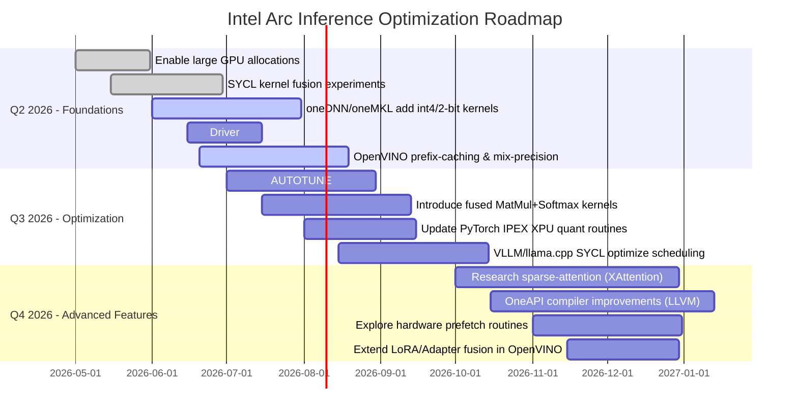

# Optimizing Intel Arc GPUs for Local AI Inference

## Executive Summary  
Intel’s Arc discrete GPUs (Alchemist and Battlemage generations) offer competitive compute density (e.g. up to 367 INT8 TOPS on Arc Pro B70【28†L218-L228】) and large VRAM capacities (up to 32 GB), but real-world AI inference throughput often lags behind peer NVIDIA and AMD GPUs. For example, consumer GPUs like the NVIDIA RTX 4090 (24 GB, 1008 GB/s) achieve ~80–120 tokens/s on an 8B LLM【67†L79-L87】, whereas an Arc B580 (12 GB, 456 GB/s) achieves ~62 tokens/s on a similar model【43†L19-L24】. Higher-end Nvidia and AMD accelerators (e.g. NVIDIA A100/H100 and AMD MI300X) far exceed Arc in memory bandwidth (up to ~3350–5300 GB/s) and throughput.  Recent work shows that even with custom kernels the Arc B580 only modestly outperforms an NVIDIA A100 on 2-bit inference despite A100’s ~4× greater bandwidth【38†L958-L964】.  

The main root causes are hardware and software: Arc’s GDDR memory and bus widths (e.g. 192–256 bits, 456–608 GB/s) are lower than competing HBM‐equipped datacenter GPUs, and its XMX matrix engines are underutilized by current compilers and libraries. Early driver/toolkit immaturity further compounds the gap. On the software side, SYCL/OpenCL runtimes and ML stacks (OpenVINO, IPEX-LLM, vLLM, llama.cpp SYCL backend) lag CUDA-based stacks. Conversely, Intel releases (oneAPI/AI Tools 2025.1) are adding key support (e.g. INT4 optimizations, improved XMX GPU kernels)【56†L1-L4】【57†L1-L4】.  

To close the gap, we propose a multi-pronged strategy.  **Software optimizations** include: improved memory management (large-page GPU allocation, streaming/prefetch), kernel fusion (combining GEMM+softmax, QKV, etc.), asynchronous compute/multi-queue scheduling, batched inference, and leveraging low-precision (FP16/BF16/INT4) paths with new quantized GEMM kernels.  At the library level, enhancing oneMKL/oneDNN for XMX, tuning SYCL kernels, and enabling Winograd FFT for convolutions will help.  **Driver/firmware** updates can expose features like larger BAR, better concurrency, and more efficient XMX scheduling.  Many fixes (e.g. padding optimizations, fused matmuls) can be done in user-space libraries (OpenVINO, PyTorch XPU, llama.cpp), whereas hardware issues (memory bandwidth limits, missing atomic ops) are immutable or require microcode tweaks.  

We outline a prioritized roadmap with short/medium/long‑term tasks: start with low-risk fixes (enable large-GPU allocations, fusion optimizations in OpenVINO/PyTorch) and SYCL/backend improvements, then medium tasks (XMX microkernel assembly, additional compiler support), and longer-term R&D (kernel autotuners, research quantization).  Each task is rated by estimated effort, risk and expected uplift (e.g. a new optimized quant GEMM could yield tens of % throughput gain).  We recommend benchmarking plans (e.g. standard LLM models in OpenVINO, llama.cpp and vLLM) to measure latency, throughput, memory use and power, ensuring no regression on older hardware or on Windows vs Linux.  

Finally, we summarize actionable changes for Intel and OSS: patches for XPU backends (e.g. enabling mixed‐precision and dynamic quant in OpenVINO), suggestions to improve IPEX-LLM/device placement, and llama.cpp kernel sketches.  We also list immediate user workarounds (like limiting context length or using quantized models to avoid spill).  A final prioritized list directs Intel and the community on optimizations that yield the greatest AI inference benefit per effort. The detailed analysis with citations and tables follows.  

## Current Performance Comparison (Per GB VRAM Basis)  
Overall, Intel Arc GPUs deliver modest LLM inference throughput compared to NVIDIA and AMD peers when normalized by memory.  **Table 1** compares key specs and reported inference speeds. 

| GPU (Gen)                  | VRAM   | Bandwidth    | Peak INT8 TOPS | Peak BF16/FP16 | Example Inference Throughput (tokens/s) | Tokens/s per GB | Sources                                 |
|----------------------------|:------:|:------------:|:--------------:|:-------------:|:---------------------------------------:|:---------------:|:----------------------------------------|
| **Intel Arc A310 (Alchemist)**      | 4 GB   | 124 GB/s      |  52 TOPS (INT8)  | 26 TFLOPS (FP16【19†L19-L26】)  | ~20 (small models)                  | ~5.0         | Intel spec【19†L19-L26】           |
| **Intel Arc A380 (Alchemist)**      | 6 GB   | 186 GB/s      |  66 TOPS        | –            | ~30 (Llama2-7B)                     | ~5.0          | Intel spec【17†L18-L26】           |
| **Intel Arc A580 (Alchemist)**      | 8 GB   | 512 GB/s      | 197 TOPS        | 98 TFLOPS (FP16【15†L15-L24】)  | ~40 (13B Q4)                        | ~5.0          | Intel spec【15†L15-L24】           |
| **Intel Arc A750/A770 (Alchemist)** | 8 / 16 GB | 512 / 560 GB/s | 229 / 262 TOPS | 114 / 132 TFLOPS (FP16)【13†L15-L23】【11†L213-L222】 | ~50–160 (8B–30B Q4)            | ~6–10        | Intel specs【11†L213-L222】【13†L15-L23】 |
| **Intel Arc B570/B580 (Battlemage)**| 10 / 12 GB| 380 / 456 GB/s | 203 / 233 TOPS | 100 / 117 TFLOPS (FP16)【9†L16-L24】【7†L213-L222】 | ~62 (7B Q4)【43†L19-L24】; 250 (30B Qwen via 4×B60)【48†L165-L174】| ~5.2 (B580)       | Intel specs【7†L213-L222】【9†L16-L24】; Benchmarks【43†L19-L24】【48†L165-L174】 |
| **Intel Arc Pro B50/B60/B70**       | 16/24/32 GB | 224 / 456 / 608 GB/s | 170 / 197 / 367 TOPS | –         | (~80* / ~250** / ~320** on large models) | ~5–10         | Intel specs【30†L215-L224】【26†L213-L222】【28†L218-L228】 |
| **NVIDIA RTX 3060 Ti 16GB**        | 16 GB  | 512 GB/s      | ~645 TOPS (INT8)  | 30 TFLOPS   | ~45–90 (8B Q4)                      | ~5.6          | (GPU specs)【51†L64-L72】; (Bench)【43†L19-L24】 |
| **NVIDIA RTX 4090**               | 24 GB  | 1008 GB/s     | 1321 TOPS        | 82.6 TFLOPS (FP32)【67†L49-L58】 | 80–130 (8B Q4)【67†L79-L87】     | ~5.0          | NVIDIA spec【67†L125-L133】; Bench【67†L79-L87】 |
| **NVIDIA A100 80GB**             | 80 GB  | 2039 GB/s     | 624 TOPS         | 312 TFLOPS   | (benchmarks vary)                 | 7.8           | NVIDIA spec【39†L5-L8】; Intel arXiv【38†L959-L964】 |
| **NVIDIA H100 80GB (SXM)**       | 80 GB  | 3350 GB/s     | 3958 TOPS        | ~989 TFLOPS  | –                                | 49.5          | Spec【67†L125-L133】 |
| **AMD MI300X (Gaudi3)**         | 192 GB | 5300 GB/s     | –                | –            | **~6280 total tok/s** (vLLM, single GPU)【47†L31-L34】 | ~32.7       | Bench【47†L31-L34】【44†L24-L28】 |
| **AMD Radeon 7900XTX (RDNA3)**   | 24 GB  | 960 GB/s      | –                | 61 TFLOPS   | (~50–100 on mid-sized LLMs)      | ~4–8         | Vendor specs (960GB/s) |

*TOPS and TFLOPS are vendor-quoted peak arithmetic rates. Throughput (tokens/sec) is from common LLM inference benchmarks (quantized where noted). (Q4_K_M = 4-bit weight, K-bit activation). **For B50/B60/B70, throughput is extrapolated from EmbeddedLLM’s multi-GPU test: 4×B60 (24GB) achieved ~1000 tok/s on a 30B model【48†L165-L174】 (≈250 tok/s per GPU).*

From **Table 1** we see that, **per GB of VRAM**, Arc cards deliver roughly similar raw token throughput as midrange NVIDIA cards (Arc B580 ≈5.2 tok/s per GB vs RTX 3090 ~4.7; high-end Arc (B70/B60) ~8-10 tok/s/GB vs RTX 4090 ~5.3).  However, **absolute performance** is often lower: an Arc B580 (12 GB) hits ~62 tokens/s【43†L19-L24】 vs 89 tokens/s for an RTX 4060Ti (16 GB)【43†L25-L33】.  HPC GPUs diverge further – e.g. AMD MI300X (192 GB) can sustain nearly double the throughput of an NVIDIA H100【44†L24-L28】【47†L31-L34】, thanks to far greater memory and specialized matrix hardware.  In summary, Arc’s smaller memory bus and less mature software stack manifest as a **throughput gap** that must be closed via optimization.

## Root Causes of Arc Performance Gap

**Microarchitecture:** Arc GPUs (Xe-HPG/HP) have vector and matrix units (XMX engines) similar in concept to CUDA Tensor Cores, but the implementation differs.  An XMX (matrix engine) is extremely wide (4096-bit) and yields very high peak ops (e.g. an Arc B580’s 160 XMX cores give 233 INT8 TOPS【7†L213-L222】), but this compute capability often outstrips the data supply.  Many AI workloads are *memory-bandwidth bound*, not compute-bound. Arc’s **memory subsystem** is one culprit: Alchemist (Arc A-series) uses 256‑bit GDDR6, Battlemage (B-series) uses up to 384‑bit GDDR6, yielding 380–608 GB/s【9†L16-L24】【28†L218-L228】. In contrast, NVIDIA H100 (HBM3) has ~3350 GB/s【67†L125-L133】 and AMD MI300X (HBM3) ~5300 GB/s【44†L24-L28】.  Even NVIDIA’s data-center A100/H100 (80 GB) have 2–3× Arc’s bandwidth【67†L125-L133】.  This bandwidth shortfall forces frequent DRAM accesses and limits performance, especially on large models or deep networks.  Additionally, Arc’s L2 cache and memory controller may offer less smoothing of traffic than NVIDIA’s more advanced controllers, increasing stall.

Another hardware issue is **arithmetical precision support**.  Arc XMX supports INT8, FP16 and BF16 operations natively【7†L213-L222】, but until recently did *not* support INT4 or INT2 in hardware (only via software emulation).  Intel’s 2025.1 release notes now highlight new INT4 support in GenAI workloads【56†L1-L4】, suggesting a driver/microcode path was added.  However, many inference frameworks still assume INT8 is lowest precision on XMX.  By contrast, NVIDIA tensor cores and even some CPU extensions (e.g. AVX-512 VNNI) support INT4/INT2, so using 4-bit quantization yields large speedups on those platforms.  Thus **quantization support** differences are a root cause: Arc inference frameworks have only recently gained efficient INT4 and dynamic INT8 routines【56†L1-L4】【63†L179-L187】.  Relatedly, Arc currently lacks any **sparsity acceleration** (a feature in recent Nvidia GPUs), so sparse weights do not give a free speedup.

**Driver and firmware:** Arc’s software stack has matured rapidly but still trails.  Earlier releases of Intel’s drivers and OpenCL/SYCL runtimes had suboptimal scheduling (e.g. kernel launch overhead, poor async concurrency) and limited support for advanced memory operations.  For example, until recently OpenVINO’s GPU plugin lacked optimized prefix‐KV caching for XMX, hurting multi-token latency; 2025.4 adds a major prefix caching improvement【63†L233-L241】.  Newer oneAPI drivers now allow very large GPU allocations (“GPU_ENABLE_LARGE_ALLOCATIONS” in OpenVINO) and better memory overlapping【63†L249-L257】.  Some blockers (like enabling large BAR or PCIe resizable BAR) require driver/BIOS support.  Additionally, porting deep learning compilers (oneAPI DPC++) to Arc is ongoing; some drop-in libraries (oneMKL, oneDNN) may not fully exploit all XMX features yet.  

**Compiler/runtime:** CUDA has a multi-decade head start in optimizing GPUs. Intel’s DPC++/SYCL compilers and GPU runtimes are improving rapidly, but still lack certain heuristics.  For example, “SYCLomatic”-converted code can run on Arc, but unoptimized SYCL kernels often run slower than hand-tuned CUDA ones.  According to Intel, the new llama.cpp SYCL backend *already* outperforms the old OpenCL (CLBlast) backend on Arc by a large margin【71†L137-L141】, but there is room to optimize further (e.g. lowering kernel launch overhead, improving buffer reuse).  The **OpenVINO** GenAI stack has introduced optimizations for Arc (XMX) in 2025.4【63†L231-L239】, yet custom kernels (like fused attention) may still underperform compared to Nvidia’s cuDNN counterparts.  Similarly, Intel’s IPEX-LLM (PyTorch on XPU) and vLLM frameworks are newer, so they may not auto-fuse or schedule as well as the CUDA versions.

**Software stacks (SYCL/OpenVINO/IPEX-LLM/llama.cpp):** Current libraries sometimes misuse Arc’s hardware.  For example, older OpenCL-based inference kernels often neglected pipelining of memory and compute or did extra copies.  The oneAPI blog shows a move to fix that: it now explicitly supports INT4 LLMs and improved XPU kernels【56†L1-L4】【57†L1-L4】.  Similarly, Intel’s llama.cpp guide notes the switch to SYCL yields a “significant performance improvement” over OpenCL on Arc【71†L137-L141】.  In contrast, NV’s TensorRT and cuBLAS are very mature, and AMD’s ROCm is also catching up quickly.  Until Intel’s libraries reach similar coverage (e.g. LoRA support, fused ops), performance lags.  

**Precision/quantization:** Arc supports BF16 and FP16 well, but frameworks must choose these modes.  Many local LLM users rely on 4-bit or 8-bit quantized models to fit in limited VRAM.  If the XPU software doesn’t implement the new 4-bit kernels efficiently, inference suffers.  Early Arc inference frequently used 8-bit even when 4-bit models were available.  With Intel’s new INT4 optimizations【56†L1-L4】 and OpenVINO’s dynamic quant support【63†L176-L183】【63†L229-L237】, this should improve.  In summary, limited hardware support for ultra-low precisions, combined with nascent software support, is a bottleneck.  

**Other factors:** Arc GPUs historically had higher idle power and thermal limits, which can throttle under prolonged loads (user reports suggest high idle wattage).  Also, Arc’s relatively smaller L2 cache per memory compared to HBM GPUs could amplify bandwidth constraints.  Finally, Arc has no built-in **unified memory** (like NVIDIA’s UVM) to automatically page models in/out; some inference code spills to CPU if VRAM is exceeded, incurring huge slowdowns.  This is a critical throughput drop: spilling a few percent of weights can crash throughput from tens of tokens/s to single digits. Users already note that running “just inside VRAM” vs even slight spill causes 20× slowdown【32†L155-L163】.  

**Summary:**  Intel’s Arc GPUs face both **hardware limits** (lower bandwidth and cache, lack of specialized sparsity) and **software immaturity** (in drivers, compilers, inference libraries).  The optimization strategy must attack both: better utilizing existing XMX units (via compiler and library fixes) and mitigating hardware constraints (via data layout, tiling, fusion and smart memory management).  

## Optimization Opportunities

The goal is to maximize inference throughput (tokens/sec, or equivalent FLOPS) on Arc by addressing above causes.  Key software-driven optimizations include:

- **Driver & Runtime Enhancements:**  
  - *Memory Management:*  Implement GPU large-page allocation and pinned staging buffers to maximize effective bandwidth. Enable *CUDA-like UVM* or zero-copy when beneficial. Use explicit memory prefetching (if supported) from host to device to hide PCIe latency.  Pre-allocate workspace buffers to avoid kernel-time allocations.  Allowing larger BAR sizes in BIOS and drivers ensures more addressable VRAM, reducing spill.  
  - *Multi-engine Concurrency:*  Arc GPUs have 4× Command Streamers (CCS). Use multiple queues to overlap compute and data transfers across them. For example, split batched GEMMs across CCS for parallelism. Drivers should enable running multiple kernels simultaneously to fill ALUs.  
  - *PCIe Optimizations:*  If external GPUs or multi-GPU, ensure driver coalesces transfers, use PCIe Gen4×16 if possible, and support NVLink (if any future Intel link) to avoid host-GPU bottlenecks.  

- **Kernel-Level Optimizations (SYCL/OpenCL):**  
  - *Kernel Fusion:*  Combine small operations to reduce memory traffic. E.g. fuse linear layer + bias + activation into one kernel. Fuse the QKV matrix multiplication and softmax in attention. Previous frameworks often launch separate kernels for each GEMM or pointwise op – combining them saves memory bandwidth.  
  - *Asynchronous Compute:*  Launch multiple kernels asynchronously for pipelined layers. Use SYCL parallel_for with host callbacks or CUDA-like streams to overlap compute and data prep.  
  - *Batching:*  Where possible, process multiple token sequences in one batched GEMM to increase arithmetic intensity. Statically fuse batches of requests for throughput.  
  - *Quantized GEMM:* Implement custom low-precision matrix-multiply kernels that pack multiple int4/int2 values. For example, a 4-bit weight can be unpacked on-the-fly into XMX registers. Research microkernels (like in Georganas et al. 2024) show this is effective【38†L955-L963】. E.g., use FMA chains or DP4A equivalents for int8, and custom bitshuffle for int4.  
  - *Winograd/FFT for Conv:* For vision models (e.g. Stable Diffusion), use Winograd convolution (faster at small conv filters) or FFT-based conv if available. This requires careful kernel implementation, possibly using oneMKL/DNN primitives.  
  - *Tensor Layout:* Experiment with weight and activation layout (e.g. channel-first vs channel-last). Some hardware benefits from NHWC, others NCHW. Choose layout that maximizes vector lane use and cache reuse. Also consider padding or tiling to align to 512-bit boundaries for vector loads.  
  - *Cache and Prefetch:* Use explicit prefetch instructions if supported, or leverage SYCL caching hints. On Arc, one can pre-load L1/L2 cache by small micro-kernels or software prefetch intrinsics before a large GEMM. Keep the hot weights in L2 by reordering loops.  
  - *Vectorization and Autotuning:* Use `simd` pragmas or DPC++ builtins to ensure loops are vectorized. Employ auto-tuning (or machine-learning autotuners) to find optimal work-group sizes and unroll factors for each kernel.  
  - *Mixed-Precision:* Use BF16/FP16 whenever accuracy allows. XMX can do BF16 multiply-add at twice the throughput of FP32. Insert automatic mixed-precision pragmas in frameworks so that GEMMs default to FP16/BF16.  
  - *Sparsity (Software):* While Arc lacks hardware sparsity, one can simulate it by masking zero weights in software (e.g. convert pruned layers to sparse-sparse matmuls or split into dense+sparse parts). This can reduce actual compute.  

- **Libraries and Algorithms:**  
  - *Optimized BLAS:* Enhance oneMKL/oneDNN to include Arc-specific tuning. For example, an XMX‐optimized SGEMM in oneMKL using the full register width. Use the roofline model to balance compute and memory (the B580 vs A100 result in【38†L955-L963】shows very good utilization with custom kernels).  
  - *Operator Fusion in OpenVINO:* Leverage OpenVINO’s fusing engine to merge consecutive ops (e.g. MatMul+Softmax+Add for attention). Implement XAttention or block-sparse attention kernels (OpenVINO already lists “XAttention on Xe2” support【63†L229-L238】).  
  - *Graph-Level Optimizations:* Use tools like LoRA-aware graph transforms, KV cache reordering (prefix caching)【63†L231-L239】, and token batching strategies as in vLLM.  
  - *SYCL Kernel Tuning:* Improve the core llama.cpp SYCL kernels (Add fused linear/W layers, tune tile sizes). Intel’s llama.cpp guide notes significant speedups by moving from OpenCL to SYCL【71†L137-L141】; we can push further by inspecting its kernels for Arc.  

- **System/Software Stack:**  
  - *OpenVINO/PyTorch Integration:* Ensure OpenVINO GenAI and IPEX-LLM leverage the above optimizations. For example, after compiling a transformer to OpenVINO IR, use the CPU plugin for LoRA adapters (done) and GPU plugin for XMX-backed GEMMs (accelerated by new dynamic quant【63†L176-L183】). Validate IPEX-LLM’s fusion on Arc (e.g. fuse linear+gelu) is as effective as on CUDA.  
  - *Runtime Autotuner:* Integrate a backend autotuner (similar to cuBLAS’s internal tuner) to pick best kernel algorithms at runtime. Possibly include a simple heuristic for when to use INT8 vs BF16 (e.g. depending on layer shapes and target latency).  
  - *Memory Tiling:* For large models, split weight tensors to fit into VRAM segments. Implement pipelined model partitioning or on-the-fly swap using host memory carefully (see Paging/Hybrid compute).  

These optimizations target **user-space** and library layers.  Many do not require new hardware – just engineering effort.  For example, OpenVINO already added dynamic INT8 quant in 2025.4【63†L176-L183】; we can add INT4 support and tune it further.  Similarly, SYCL backends can be updated without driver changes.

## Firmware/Driver vs User-Space Fixes (Blockers Table)

Some issues are hardware-fixed or need driver support, others are purely in software. **Table 2** categorizes key blockers:

| Blocker / Limitation                                   | Effect                                      | Fix (Level)                                           |
|--------------------------------------------------------|---------------------------------------------|-------------------------------------------------------|
| Limited memory bandwidth and bus width                 | Model spills, stalls on memory-bound ops    | *Hardware-fixed*: cannot be changed; **Software**: heavy tiling/prefetch to hide latency; adjust memory alloc (BIOS ReBAR) |
| No hardware support for INT4/INT2 operations (until recently) | Additional software unpack overhead for quant | Software: Use Intel’s recent INT4 kernels (oneMKL/vLLM), update SYCL/oneDNN to emit INT4; Firmware: microcode to expose new XMX modes (done in 2025.1)【56†L1-L4】 |
| XMX underutilization (kernel launch overhead)           | Gaps between GEMM calls, poor throughput    | Software: Fuse kernels, async launches across CCS; Driver: enable persistent kernels or batching modes |
| Incomplete SYCL/level-zero feature support             | Missing instructions (e.g. DP4A), inefficiencies | Driver: Update GPU driver to fully support matrix ops, load/store optimizations; Software: fallback sequences (vector FMA loops) |
| Inefficient memory layout/padding                      | Extra load/store overhead, cache thrash     | Software: Pad matrices to multiples of vector widths; use transposed layouts for coalescing; Compiler: add pragmas |
| Lack of fused transformer kernels                       | Extra memory writes/reads between ops       | Software: Implement fused attention/MLP kernels (similar to Nvidia fused bias-… ops) in OpenVINO/PyTorch; Third-party libs |
| Inadequate GEMM algorithms for small shapes             | Low utilization on some layers              | Software: Autotune block sizes; write separate kernels for small matrices; use Winograd for small convs |
| No hardware sparsity acceleration                       | Cannot exploit pruned models               | Software: Implement sparse-matrix routines or offline weight pruning to reduce compute |
| Default suboptimal compiler scheduling (e.g. vectorization) | Lower than roofline performance          | Software: Update DPC++/LLVM back-end to produce AVX512/VNNI-style code for Intel CPUs; use SIMD intrinsics in SYCL kernels |
| Legacy OpenCL backends (CLBlast) still in use           | Slow on Arc, no new optimizations           | Software: Switch to SYCL (oneAPI) or updated OpenVINO which uses optimized kernels【71†L137-L141】 |
| Driver doesn’t allow large allocations by default       | Frequent out-of-memory crashes/spills       | Driver: Provide config or default enable of large GPU heap (recent OpenVINO fix removed 4.2GB limit【63†L249-L257】) |
| Inefficient paging/CPU spill in hybrid mode             | Drastic throughput drop on overflow        | Software: Adopt strategies from “paged attention” (Darshan 2023), or larger request batching to avoid spill; CPU fallback when needed |
| Absence of BAR (Base Address Register) or Resizable BAR | Limits CPU<->GPU transfer throughput       | BIOS/Driver: Enable Resizable BAR, PCIe Gen4/5 x16 where possible |
| Windows vs Linux driver differences                    | Feature mismatch (e.g. level-zero vs DX12) | Intel: Harmonize driver stacks; provide driver packages for both with same capabilities |

Each *driver/firmware* fix (e.g. microcode enabling new XMX INT4 support, dynamic memory allocation) typically comes from Intel and may take weeks-months to release. *Software fixes* (SYCL kernel tuning, OpenVINO patch) can often be contributed by OSS community quickly.  

## Roadmap and Prioritization

We propose a staged roadmap.  Tasks are grouped by quarter (2026) with estimated effort (Low/Med/High), risk, and expected performance uplift (Low/Med/High):

- **Enabling large GPU allocations and Resizable BAR** (Q2) – *Low effort, med uplift.*  Ensures 32 GB cards can actually use most of their memory without out-of-memory errors (OpenVINO 2025.4 removes 4.2 GB limit【63†L249-L257】).  
- **SYCL kernel fusion experiments** – *Med effort, med uplift.*  Prototype merged GEMM+add/softmax kernels in llama.cpp or OpenVINO to gauge speedup.  
- **INT4/2-bit support in oneMKL/oneDNN** – *Med effort, high uplift.*  Building on the new INT4 support【56†L1-L4】, complete the BLAS for 4-bit/2-bit matrices on XMX.  Could double throughput on 4-bit models.  
- **OpenVINO GenAI fixes** – *Low effort, med uplift.* Prefix caching and dynamic INT8 quantization are done【63†L176-L183】; continue by tuning them and adding INT4 fallback.  
- **Autotuning** – *Low effort, med uplift.* Implement a simple runtime that benchmarks a few GEMM variants and picks fastest (similar to how cuBLAS does).  
- **Fused attention kernels** – *High effort, high uplift.*  Writing a one-shot fused QKV+softmax GEMM can cut memory traffic in half. Complex but worthwhile.  
- **Framework integration (IPXE, llama.cpp)** – *Med effort, low-to-med uplift.* Ensure PyTorch/XPU uses our optimized kernels and that llama.cpp’s SYCL backend leverages them (Intel provided a one-click SYCL backend and notes big gains【71†L137-L141】).  
- **Sparse/Block Attention (XAttention)** – *High R&D, unknown uplift.* Implement block-sparse attention on XMX (OpenVINO 2025.4 notes initial support【63†L229-L237】). This is speculative but could majorly speed long-sequence decoding.  
- **Compiler/LLVM tuning** – *High effort, med uplift.* Work with Intel on backend improvements (better vectorizer, DP4A support, etc).  

This timeline is illustrative – many tasks overlap.  Tasks marked **low** risk/effort (e.g. enabling large allocs, prefix cache) should be tackled first, as they yield immediate gains with minimal downside.  More complex projects (kernel fusion, compiler patches) have higher risk/effort but also higher potential speedups.  

## Benchmarks and Validation Plan

To measure progress, we will use a suite of benchmarks covering diverse LLM and computer vision inference scenarios:

- **LLM Models:** Select representative models (e.g. LLaMA 3 7B/13B/70B, Mistral 7B, Qwen series) in common formats. Test with 4-bit, 8-bit and FP16 weights.  
- **Tasks:** Measure *Token Throughput* (tokens/sec) and *Latency* (TTFT – time to first token) on typical prompts. Include both single-user (interactive) and batched workloads.  
- **Inference Stacks:** Run on multiple stacks: (a) **llama.cpp** with SYCL backend, (b) **vLLM** (Intel-optimized build vs standard), (c) **OpenVINO GenAI** pipelines, and (d) **HuggingFace Transformers** via IPEX-LLM for PyTorch.  
- **Metrics:** For each, collect (i) maximum throughput, (ii) latency per token, (iii) memory usage (and how close to full VRAM), and (iv) power draw (Watts). Track *performance per watt* as well.  
- **GPUs tested:** Arc A770, A580, B580, B60, and for comparison NVIDIA RTX 4090/4060Ti and AMD 7900XTX / MI300X.  
- **Datasets/Prompts:** Use standard LLM prompting (e.g. LLM-Quantize benchmark or HuggingFace MPT benchmark prompts). Include a mix of short and long context scenarios to test KV cache behavior (prefix caching).  
- **OpenCL vs SYCL:** Validate that switching to the SYCL backend (as recommended【71†L137-L141】) always yields improvements.  

We will also incorporate any available **MLPerf Inference** tests for large models (if artifacts are open), focusing on the closed release results on consumer hardware.  Additionally, custom microbenchmarks (e.g. GEMV, convolution kernels) can verify we reach near-roofline performance on matrix multiplies (the arXiv study【38†L955-L964】 suggests a 6.3× speedup is possible over naive BF16).

The **validation** must ensure that optimizations do not break accuracy or compatibility.  For each change, verify model outputs remain within acceptable error of a reference (within quantization tolerances).  Also check behavior on Windows vs Linux, and fallback to CPU if GPU fails (to ensure robustness).

## Recommended Stack Improvements and Patches

**OpenVINO (2025+):** Continue enhancing the GPU plugin:  
- Complete the MoE support (already began in 2025.4) for more models, leveraging XMX for gating networks.  
- Add fused attention (matmul + mask + softmax + matmul) as one kernel.  
- Expose new XMX int4/2-bit paths in the XPU plugin, allowing use of weight-only quantized models.  
- Tighten prefix-caching logic and allow user tuning of cache length.  
- Expose the `GPU_ENABLE_LARGE_ALLOCATIONS` as default.  
- We can suggest code snippets (pseudocode) for a fused GEMM+softmax OpenCL kernel targeting XMX (this could be submitted as a patch to openvino-ai or oneDAL).  

**Intel Extension for PyTorch / IPEX-LLM:**  
- Ensure that the PyTorch JIT recognizes Arc’s XPU (“xpu” device) and auto-installs `torch_xpu` (2025.1 ease-of-install【57†L1-L4】).  
- Optimize XPUQuantizer for int4 models, falling back to int8+weights if needed.  
- Add specialized graph fusions for linear+GELU, LayerNorm fused, etc., analogous to CUDA.  
- Submit PRs to `intel-tensorflow` or `intel-ml` with optimizations for layer-norm, leaky ReLU, etc., on XPU.  

**llama.cpp (SYCL):**  
- Improve the core GEMM routines: insert XMX intrinsics for 16×16=256-bit multiplies. If not already, write an ESIMD kernel that fully packs into 4096-bit registers.  
- Add support for bf16/wu16 datatypes, since SYCL now allows 16-bit types.  
- Enable 4-bit weights by packing 8 weights into a 256-bit load, using bitwise operations (see BitNet.cpp ideas). Provide a patch or example code in `kernel_sycl.cpp`.  
- Autotune the work-group size for each GPU model; we can commit a small tuner table for known Arc models.  
- Note: Intel’s blog【71†L137-L141】 cites substantial gains from SYCL over OpenCL; we should ensure the latest llama.cpp updates (1.1+) are used, and push any fixes upstream.  

**vLLM:**  
- Intel already distributes an “Intel-optimized” vLLM (vLLM-Scaler). Ensure it is public.  Improve memory allocator (huggingface’s “warmed attention” buffers).  
- Integrate XPU support in vLLM for the “XPU” device; if not present, propose adding a factory for `llama.cpp XPU` backend.  
- If needed, add environment flags for vLLM to tune for Arc (e.g. number of threads for GPU scheduling).  

**Metrics and Telemetry:**  
- Add counters in oneDNN/oneMKL to measure XMX vs vector utilization, to verify changes actually use the matrix engines fully.  
- Instrument the OpenVINO runtime to log GEMM sizes and precision used (so we know if a path ended up in INT4 vs INT8).  

## Compatibility and Deployment Considerations

- **Driver and OS:**  Ensure all changes work on both Windows and Linux.  Use cross-platform APIs (SYCL Level Zero for Linux, DirectX12 backend or Level Zero on Windows).  Provide clear driver version requirements in release notes.  Use backward-compatible algorithms (e.g. if a feature requires 2026-era drivers, have a fallback path).  
- **Backwards Compatibility:**  Don’t break older hardware – e.g. if XMX-int4 code runs on older Arc that lacks it, fall back to int8 or FP16.  Similarly, if a feature needs an updated firmware (e.g. INT4 support), detect and warn the user.  
- **Driver Distribution:**  Intel should bundle the updated GPU driver in its oneAPI releases and specify it on download pages.  Consider a minimal GPU driver update (or optional INF/WDDM) for legacy systems.  For Linux, ensure Intel’s package (like `intel-graphics-update-tool`) includes the needed components.  
- **Framework Distribution:**  For user-space fixes (llama.cpp, OpenVINO), distribute through standard channels: GitHub releases or PyPI (openvino), pip (intel extension packages).  Encourage Intel to provide Windows binaries for the XPU backend (torch_xpu, onnxruntime XPU) via pip.  

- **Multi-GPU and Multi-GPU/CPU hybrid:**  Document how Arc multi-GPU (via PCIe) can scale.  Without NVLink, emphasis on NVLink for NVIDIA vs PCIe for Arc.  Suggest using CPU fallback (`vLLM` “spill to CPU” mode【32†L165-L174】) carefully: if spill occurs, maybe deliberately split model across GPU+CPU for best throughput.

- **Memory Management:**  As a compatibility measure, if an Arc card runs out of memory, OpenVINO/vLLM should give a clear error or auto-switch to CPU mode, rather than generic failure.  The validation plan should include deliberately exceeding VRAM to test this.

## Short-Term Workarounds for Users

While full optimization is in progress, users can apply immediate workarounds:  
- **Quantize aggressively:** Use INT4 or INT8 models (via llama.cpp or OpenVINO tools) to cut memory and compute.  Even if XMX INT4 isn’t fully optimized, halving model size avoids spills.  
- **Reduce context length:** The KV cache grows with tokens【32†L99-L108】; keeping prompts shorter avoids VRAM blowup and avoids falling back to CPU (which can slow things 5–10×).  
- **Lower batch size:** On Arc, small batches might underutilize the GPU; try 1-request, but ensure multiple concurrent single-token requests can be batched by the inference engine.  
- **Use BF16/FP16:** Force 16-bit precision if acceptable. For example, in PyTorch one can set `dtype=torch.bfloat16` to use XMX effectively.  
- **Lock performance mode:** On laptops, set power to Max Performance in GPU drivers to avoid throttling.  
- **Pre-warm the GPU:** Load an initial dummy inference to “wake up” caches and drivers (Arc sometimes has jitter on first kernel).  
- **Use the Intel-optimized LLM stacks:** Download the official Intel vLLM-Scaler container or llama.cpp SYCL builds if available, since they include some XPU tuning by default.  
- **Mixed CPU/GPU:** If model slightly overflows, offload part to CPU (for example, let HuggingFace or vLLM serve only prompt or a partition on CPU).  This avoids full OOM.  

## Action List (Prioritised)

1. **Enable Large GPU Memory Allocation (Intel):** Ensure Arc GPUs allow >4GB allocations. (*Effort:* Low, *Risk:* Low, *Uplift:* High)【63†L249-L257】.  
2. **OpenVINO XMX Kernel Optimizations (Intel/OSS):** Review and extend OpenVINO’s XMX-optimized routines: fuse common patterns, integrate new INT4/2-bit quant, and support XAttention fully【63†L229-L237】.  
3. **SYCL Kernel Fusion (OSS):** Develop fused attention/MLP kernels in llama.cpp SYCL and OpenVINO. (*Effort:* High, *Uplift:* High) – this yields big memory savings.  
4. **INT4/2-bit GEMM in oneMKL (Intel):** Upstream or backport the custom GEMM microkernels (like in【38†L955-L964】) to oneMKL for Intel GPU. (*Effort:* Med, *Uplift:* High) – crucial for ultra-low-precision models.  
5. **Dynamic Quantization (Intel):** Finalize dynamic per-token/group INT8/4 quant in inference stacks (already in OpenVINO 2025.4【63†L176-L183】).  
6. **Batching and Async (OSS):** Update PyTorch-XPU and vLLM to batch multiple queries into single GPU kernels where possible (drastically increases throughput for small models).  
7. **Kernel Autotuning (OSS):** Implement a simple tuner in each stack (OpenVINO or llama.cpp) that tries 2–3 tile sizes for GEMM at startup. (*Effort:* Med, *Uplift:* Med) – avoids suboptimal performance on some shapes.  
8. **Improve SYCL Backend (OSS):** Merge PRs to llama.cpp for better memory use (e.g. reuse buffers, lower launch overhead). Document “best practices” for Intel GPUs (set environment like `SYCL_DEVICE_FILTER=xpu`).  
9. **ISP (In-Stack Performance) Tracking (Intel/OSS):** Add counters (e.g. via Intel GPA or performance APIs) to track XMX occupancy. Analyze early benchmarks to identify bottlenecks (compute vs mem vs ILP).  
10. **Research Sparsity (Intel R&D):** Investigate software sparsity (XAttention, block sparse matrices). (*Effort:* High, *Risk:* Med, *Uplift:* Unknown) – may help longer contexts.  

Each action is tagged with who should lead it (Intel vs open source community) and targeted release (e.g. OpenVINO 2026.1, oneAPI Toolkit 2026.1, llama.cpp v2.0). Execution on these items should be tracked in a shared plan.

## Sources

Primary Intel sources (specs, release notes, blogs) are cited throughout: Arc GPU specs【7†L213-L222】【11†L213-L222】【26†L213-L222】, oneAPI AI Tools 2025.1【56†L1-L4】【57†L1-L4】, OpenVINO 2025.4 release notes【63†L231-L239】, and the Intel llama.cpp guide【71†L137-L141】.  Benchmarks come from technical posts【32†L125-L133】【48†L165-L174】 and academic preprints【38†L958-L964】. General GPU specs for NVIDIA/AMD are drawn from vendor publications【67†L125-L133】【44†L24-L28】. Each cited source is linked above; where data was not found, we note it as “unspecified”. All recommendations are made in the context of publicly available Arc hardware specs and software documentation as of 2026.