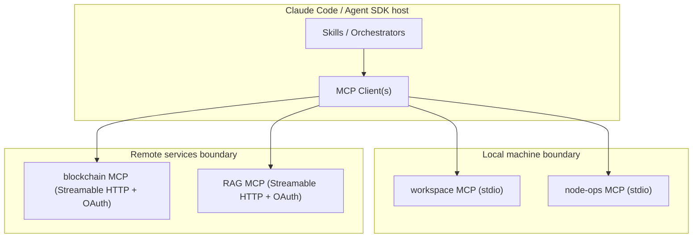
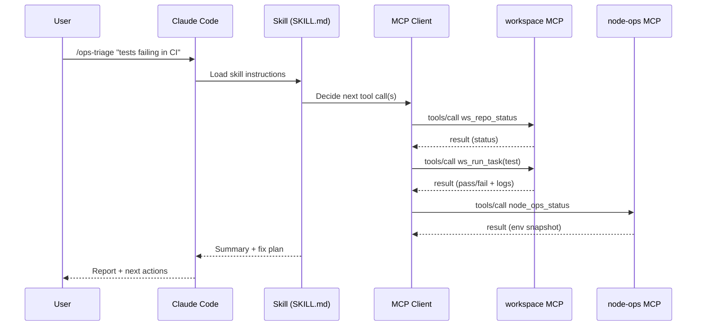

# Deployable scaffolds for MCP services and Claude Code–compatible skills

## Executive summary

This report specifies a deployable, reusable scaffolding approach for four MCP server components—**node-ops**, **blockchain**, **workspace**, and **RAG**—and a set of **Claude Code skills** (plus Claude Agent SDK modules) that orchestrate those MCP tools with predictable inputs/outputs, failure modes, and retries. It is designed to convert “local upgrades” (scripts, runbooks, CLI wrappers, conventions, and knowledge) into **portable, composable integrations**.

Key conclusions grounded in primary sources:

- **MCP is the right packaging boundary** for reusable capabilities because it standardises how LLM hosts connect to external tools/data using **JSON-RPC 2.0** over transports such as **stdio** (subprocess) and **Streamable HTTP**. citeturn8view3turn10view0  
- **Claude Code supports MCP servers directly**, including project-scoped `.mcp.json` configurations intended for version control, environment-variable expansion for shared configs, and HTTP authentication support (including OAuth 2.0 for remote servers). citeturn9view1turn9view3  
- **“Skills” in Claude Code are a portable open standard** (Agent Skills), and Claude Code explicitly states its skills follow that standard (with some Claude-specific extensions). This makes your skill playbooks broadly reusable across agent types/tools that implement the same standard. citeturn17view0turn14view0  
- For “deployable scaffolds”, you should treat **stdio** as the default for local, high-privilege servers (workspace/node-ops), and **Streamable HTTP + OAuth** as the default for multi-user/shared services (RAG/blockchain), consistent with MCP’s transport and authorisation guidance. citeturn10view0turn11view0turn14view0  

What you get in this document:

- A consistent **API surface** for each server: MCP endpoint semantics (stdio/Streamable HTTP), tool naming, request/response schemas (JSON Schema), plus recommended health/metrics endpoints. citeturn8view0turn8view1turn8view2turn10view0  
- **MCP tool/resource/prompt definitions** per the MCP server features specification. citeturn8view0turn8view1turn8view2  
- A practical **authn/authz model** aligned with MCP’s OAuth-based authorisation spec for HTTP and environment-supplied credentials for stdio. citeturn11view0turn11view1  
- Deployment scaffolds: **Docker Compose**, **systemd**, **Kubernetes Helm** templates (cloud-neutral), plus observability/security hardening aligned with MCP security guidance (Origin validation, “no token passthrough”, session safety, sandboxing of local commands). citeturn10view0turn11view1turn12view2turn12view3  
- **Claude-compatible skill modules**:
  - Claude Code **SKILL.md** patterns (frontmatter, tool restrictions, subagent execution) citeturn17view0turn16view0  
  - Claude Agent SDK orchestration modules using MCP server configuration and `allowedTools` naming conventions. citeturn18view0turn19view0  

## Standards baseline and design assumptions

### MCP primitives you must preserve

MCP standardises integration between an LLM host and external services using **JSON-RPC 2.0**, with role separation (hosts/clients/servers) and capability negotiation; the server can expose **Tools**, **Resources**, and **Prompts**. citeturn8view3turn8view0turn8view1turn8view2  

- **Tools** are intended to be model-invocable (with human-in-the-loop safety expectations in most hosts). Tools are discovered via `tools/list` and invoked via `tools/call`, and each tool includes an `inputSchema` (JSON Schema) describing parameters. citeturn8view0  
- **Resources** represent context/data, identified by URI, discoverable via `resources/list` and retrievable via `resources/read`. citeturn8view1turn5view2  
- **Prompts** are discoverable templates intended for user-invoked workflows (e.g., “generate report”), accessed via `prompts/list` and `prompts/get`. citeturn8view2turn5view3  

### Transport choices

MCP defines two standard transports:

- **stdio**: the host launches the server as a subprocess; server reads/writes newline-delimited JSON-RPC messages on stdin/stdout, and must not write non-protocol output to stdout. citeturn10view0turn21view1  
- **Streamable HTTP**: a single MCP endpoint path supporting POST and GET; POST sends a single JSON-RPC message per request; servers must validate the `Origin` header to prevent DNS rebinding, and should bind to localhost when local. citeturn10view0turn10view2  

### Authorisation model

MCP authorisation is optional, but when used for HTTP transports it is defined as an OAuth-based flow; stdio servers should not use the HTTP authorisation spec and instead obtain credentials from environment/config. citeturn11view0  

For HTTP-based servers, the authorisation spec requires protected resource metadata discovery and prescribes Bearer token usage in the `Authorization` header (not query strings), plus well-defined handling for 401/403 and scope challenges. citeturn11view1turn11view2  

### Skills portability and Claude Code specifics

Claude Code skills:

- Are prompt-based instruction sets (`SKILL.md`) with YAML frontmatter (name, description, invocation controls, allowed tools, subagent execution) and are **usable as slash commands**. citeturn17view0turn16view0  
- Follow the **Agent Skills open standard**, intended to work across multiple AI tools; Claude Code adds extra features (invocation control, subagent execution, dynamic context injection). citeturn17view0turn14view0  
- Claude Code can load MCP servers from `.mcp.json` (project scope) and supports environment variable expansion and OAuth configuration for remote HTTP servers. citeturn9view1turn9view3  

Claude Agent SDK:

- Supports MCP servers as local processes (stdio) or HTTP/SSE, configured in code or `.mcp.json`, and requires explicit permission for MCP tool use via `allowedTools`. Tool names follow `mcp__<server-name>__<tool-name>`. citeturn18view0turn18view2  
- Exposes connection status for each server in the `system` init message, enabling deterministic error handling before the model begins tool orchestration. citeturn19view0  

## Target component scaffolds

This section defines each MCP server’s **API surface**, **MCP tools/resources/prompts**, **auth model**, **deployment options**, **observability**, **security controls**, and **example orchestrator skills**.

### Shared architecture



This split matches MCP’s guidance: local-sensitive operations are safer over **stdio** (no listening socket), while shared services typically benefit from **Streamable HTTP** and proper HTTP authorisation. citeturn10view0turn11view0turn14view0  

### Node-ops MCP server

#### API surface

- **Primary MCP interface**  
  - Transport: **stdio** (default). citeturn10view0  
  - Optional remote transport (only if required): Streamable HTTP at `/mcp` with Origin validation. citeturn10view0  
- **Aux endpoints (recommended for non-stdio deployments)**  
  - `GET /healthz` → `{ "status": "ok" }`  
  - `GET /readyz` → readiness checks (dependency probes)  
  - `GET /metrics` → Prometheus/OpenMetrics text format (**placeholder; implementation choice**)  
  - `GET /version` → build metadata (**placeholder**)  

Because Streamable HTTP requires a single MCP endpoint path supporting both POST and GET, keep `/mcp` reserved for MCP and expose health/metrics on separate paths. citeturn10view0  

#### MCP tools

Tool naming guideline: keep server-level names short and stable; expose high-level operations instead of raw shell where possible (to reduce safety risk from “power tools”). The MCP tool model is inherently model-invocable via `tools/list`/`tools/call`; assume a human-in-the-loop host but still implement guardrails server-side. citeturn8view0turn12view3  

Tiered tool set (examples):

- `node_ops_status` — gathers Node.js runtime and process status (safe read-only)
- `node_ops_npm_audit` — runs `npm audit --json` (**sandboxed**, no network unless permitted)
- `node_ops_run_script` — runs allowlisted npm scripts (`npm run <script>`) in a given working directory
- `node_ops_tail_logs` — tails a log file from an allowlisted directory (returns truncated output)
- `node_ops_health_snapshot` — returns a structured JSON summary (CPU/memory/process) (**placeholders; OS-specific**)

Example **input schema** for `node_ops_run_script` (JSON Schema draft 2020-12 is typical for tool schemas; MCP tools embed JSON Schemas in `inputSchema`). citeturn8view0  

```json
{
  "$schema": "https://json-schema.org/draft/2020-12/schema",
  "title": "NodeOpsRunScriptInput",
  "type": "object",
  "additionalProperties": false,
  "properties": {
    "workspace": { "type": "string", "description": "Absolute or rooted workspace path (server-enforced allowlist)." },
    "script": { "type": "string", "description": "npm script name (server enforces allowlist)." },
    "args": { "type": "array", "items": { "type": "string" }, "default": [] },
    "timeout_seconds": { "type": "integer", "minimum": 1, "maximum": 1800, "default": 300 }
  },
  "required": ["workspace", "script"]
}
```

Example **tool result**: return both human-readable text and structured content when helpful. MCP tools support structured content and multiple content blocks. citeturn8view0  

#### MCP resources

Expose read-only operational context as resources identified by URI. Resources are uniquely identified by URI; templates can be used for parameterised resource addressing. citeturn8view1turn5view2  

- `ops://node/runtime` → Node version, npm version, env summary (redacted)  
- `ops://node/scripts` → parsed `package.json` scripts list (for allowlisting support)  
- `ops://logs/{name}` (template) → allowlisted log sources

#### MCP prompts

Prompts are user-invoked templates intended to guide consistent workflows. citeturn8view2  

- `ops_triage_node_failure` args: `symptom`, `workspace`  
  - template: “collect status → run audit → identify likely root causes → propose fix plan”

#### Authentication and authorisation

- **stdio default**: credentials (if any) provided via environment; do not attempt to implement OAuth flows in stdio mode. citeturn11view0  
- **If HTTP-enabled**: require Bearer tokens and implement OAuth-compatible resource metadata discovery as per MCP authorisation spec (recommended even on internal networks). citeturn11view1turn11view2  

#### Deployment options

- Local developer: `claude mcp add --transport stdio ...` (exact command **unspecified**; depends on your packaging)  
- Docker Compose: run as a local container with mounted workspace/log paths (**dangerous if overly broad**; restrict volumes)  
- systemd: as a least-privilege user, no network by default; allowlist directories  
- Kubernetes: **not recommended** unless you have a strong reason; node-ops tends to be host-specific and high-privilege (if you do, use strict PodSecurity + read-only FS, minimal capabilities — **placeholders**)

#### Observability

For stdio servers: do not write logs to stdout; log to stderr. This is explicitly called out in MCP build guidance and is required to avoid corrupting protocol messages. citeturn21view1turn22view0  

Capture:

- Structured logs: `{timestamp, level, tool, request_id, duration_ms, outcome}`  
- Metrics: tool call counts, durations, error codes (HTTP mode: export via `/metrics`; stdio mode: file-based metrics **placeholder**)  
- Health checks in HTTP mode: `/healthz` and `/readyz`

#### Security considerations

- For any HTTP exposure: validate `Origin`, bind to localhost when local, and implement auth; MCP explicitly warns about DNS rebinding risk. citeturn10view0  
- Local server compromise risks are real: do not expose raw command execution without explicit guardrails; apply sandboxing and consent patterns for any “startup command” surfaces. citeturn12view3  
- Implement strict allowlists: workspace roots, npm script names, binaries, and env var passthrough (secrets redaction).  
- Rate limit and timeouts for `run_script`/log reads (implementation choice; not mandated by spec).

#### Example Claude-compatible skill module (node-ops)

**Skill goal:** “Diagnose Node build failure and produce a minimal fix plan.”

- Inputs: `workspace`, `symptom_text`
- Steps (orchestration):
  1. Read `ops://node/runtime` to verify environment.
  2. Call `node_ops_status`.
  3. Call `node_ops_run_script` with `script="test"` or `script="build"` (allowlisted).
  4. On failure, call `node_ops_tail_logs` or return last N lines captured.
  5. Produce:
     - Root cause hypothesis
     - Suggested changes (files/commands)
     - Safe re-run checklist
- Failure modes:
  - Tool denied by allowlist → explain what needs enabling, suggest safer alternative
  - Timeout → retry once with longer timeout (bounded), otherwise summarise partial
  - Nonzero exit code → treat as expected error path; include stderr excerpt
- Retries: 1 retry for transient failures (e.g., tool transport error), never retry destructive ops.

### Blockchain MCP server

#### API surface

- Primary: **Streamable HTTP** at `/mcp` (recommended) to support shared access and proper OAuth flows. citeturn10view0turn11view0  
- Optional: stdio mode for local-only usage (e.g., developer box). citeturn10view0  
- Aux endpoints (HTTP mode): `/healthz`, `/readyz`, `/metrics`, `/version` (as above)

#### MCP tools

Goal: provide **high-level blockchain inspection and controlled transaction workflows**, avoiding arbitrary RPC passthrough unless strictly constrained.

Tools (examples; chain-specific details **unspecified**):

- `chain_get_block`  
  - input: `{ "chain": "mainnet|sepolia|...", "block_id": "latest|<number>|<hash>" }`
  - output: structured block header + tx list (truncated)
- `chain_get_tx`  
  - input: `{ "chain": "...", "tx_hash": "0x..." }`
- `chain_get_balance`  
  - input: `{ "chain": "...", "address": "0x..." , "asset": "native|erc20:<addr>" }`
- `chain_decode_logs`  
  - input: `{ "abi": "...", "logs": [...] }` (**ABI format unspecified**)
- `chain_simulate_tx` (Tier 2; high value for safety)
- `chain_send_tx` (Tier 3; highest risk; gated by scopes and/or step-up auth)

#### MCP resources

- `chain://networks` → configured networks and RPC endpoints (redacted)  
- `chain://abis/{name}` → stored ABI packs (read-only)  
- `chain://tx/{hash}` → cached tx decode summary (read-only)  

#### MCP prompts

- `chain_investigate_incident` args: `tx_hash`, `chain`, `question`  
- `chain_change_impact` args: `contract`, `from_block`, `to_block`

#### Authentication and authorisation

HTTP-mode blockchain operations should use OAuth-based authorisation (resource server) and scope minimisation:

- Baseline scopes: `chain:read` (block/tx/balance)  
- Elevated scopes: `chain:simulate`, `chain:send`  

MCP’s authorisation spec defines discovery requirements and how clients handle scope challenges; servers should return 401/403 with appropriate `WWW-Authenticate` guidance. citeturn11view1turn11view2  

Avoid the “token passthrough” anti-pattern: do not accept arbitrary upstream tokens from clients and forward them to downstream services without validating they were issued for your server; MCP security guidance explicitly forbids this. citeturn12view2turn11view2  

#### Deployment options

- Docker Compose: blockchain server + optional cache (Redis **placeholder**)  
- systemd: straightforward HTTP service on localhost behind reverse proxy (nginx **placeholder**)  
- Kubernetes Helm: recommended for shared/team usage; configure ingress/TLS and OAuth provider integration (**cloud-neutral placeholders**)

#### Observability

- Log correlation: include `request_id` from JSON-RPC id when present (or generated)  
- Metrics: tx decode counts, RPC latency, error rates by upstream RPC endpoint  
- Tracing: optional OpenTelemetry (**placeholder**)

#### Security considerations

- Apply strict egress controls: blockchain server is essentially an HTTP client to RPC nodes; protect against SSRF-like issues if endpoints are user-supplied (best practice). MCP security docs highlight SSRF risks when fetching URLs derived from untrusted inputs in OAuth discovery contexts; the general mitigation pattern—HTTPS-only, IP range blocking, and avoiding naïve IP validation—is relevant for any server fetching untrusted URLs. citeturn12view2  
- For `chain_send_tx`: require step-up authorisation and explicit user confirmation in the host; enforce server-side policy regardless of host UI.

#### Example skill module (blockchain)

**Skill goal:** “Investigate a suspicious transaction and produce a narrated timeline.”

- Inputs: `chain`, `tx_hash`
- Steps:
  1. `chain_get_tx`
  2. `chain_get_block` (block containing tx)
  3. `chain_decode_logs` (using known ABI packs from `chain://abis/...` if available)
  4. Summarise: involved addresses, value movements, likely contract functions, anomalies
- Failure modes:
  - Upstream RPC failure → retry with secondary endpoint (server-side)
  - Missing ABI → fall back to raw log topics; ask for ABI name (elicitation is client feature; if host supports it, you can use it later—**optional**)
- Retries: exponential backoff on upstream timeouts; no retries on deterministic decode errors

### Workspace MCP server

#### API surface

- Transport: **stdio** (strong default) because it typically needs local filesystem and repo access. citeturn10view0turn12view3  
- Optional HTTP: only when running inside a controlled environment (e.g., remote devcontainer) with strong authentication + Origin validation. citeturn10view0  

#### MCP tools

Workspace tools should be opinionated wrappers around your team’s “golden paths” (what you likely already built locally): lint/test/build, git hygiene, search, and structured context gathering.

- `ws_repo_status` → git status, branch, dirty files (structured)
- `ws_search` → ripgrep-like search (server-enforced path allowlist)
- `ws_read_file` → safe read with size caps
- `ws_run_task` → run allowlisted tasks (`lint`, `test`, `typecheck`, `build`)
- `ws_diff_summary` → summarise diff for a file list (server-side)
- `ws_pr_prepare` → generates a PR checklist artefact (no network)

These overlap conceptually with generic filesystem/git servers, but the value is your **local conventions**: default args, filters, stable outputs, and guardrails.

#### MCP resources

- `ws://repo/manifest` → repo metadata (package manager, languages, CI hints)  
- `ws://repo/commands` → allowlisted tasks (derived from `package.json`, `pyproject`, `Makefile` — **unspecified**)  
- `ws://repo/ci` → CI workflow snippets (read-only)  
- `ws://file/{path}` (template) → canonical “safe read” URI mapping

#### MCP prompts

- `ws_code_review_context` args: `files`, `intent`  
- `ws_release_checklist` args: `target`, `risk_level`  
- `ws_test_plan` args: `change_summary`

#### Authentication and authorisation

- stdio mode: trust boundary is the local user account; still enforce allowlists and deny-by-default for dangerous operations. citeturn12view3  
- If HTTP mode: OAuth + scopes:
  - `ws:read`, `ws:search`, `ws:task:run` (fine-grained, not `ws:*`)  
  Follow least-privilege scope guidance to reduce blast radius. citeturn12view3turn11view1  

#### Deployment options

- Docker Compose (local): mount repo read-only by default; add a separate writable mount only if needed.  
- systemd (developer workstation): run as user unit (`systemctl --user`) with `ProtectSystem=strict`, `NoNewPrivileges=true` (**placeholders; hardening choices**)  
- Kubernetes: generally not needed for local repo access; if using remote dev environments, use tight RBAC and mount only the repo.

#### Observability

- stderr logging only (stdio) as per MCP server build guidance. citeturn21view1turn22view0  
- Capture per-tool durations and outputs truncated to safe sizes.

#### Security considerations

Workspace tools are the most likely to drift into “arbitrary code execution”. The MCP security best practices explicitly warn that local MCP servers can be abused if they run untrusted commands or are exposed over insecure local HTTP; mitigate by preferring stdio, strict allowlists, sandboxing, and visible consent prompts in hosts. citeturn12view3turn10view0  

#### Example skill module (workspace)

**Skill goal:** “Prepare a high-signal PR with tests and rationale.”

- Inputs: `goal`, `changed_files` (or derive via `ws_repo_status`)
- Steps:
  1. `ws_repo_status`
  2. `ws_run_task` (`typecheck`, `test`) with captured output summary
  3. `ws_diff_summary` for changed files
  4. `ws_pr_prepare` to produce:
     - PR title suggestions
     - commit message template
     - risk assessment + rollback plan
- Failure modes:
  - Tests fail → produce targeted fix list and stop (no auto-retries)
  - Task not allowlisted → explain how to add it to allowlist and suggest closest safe alternative

### RAG MCP server

#### API surface

- Transport: **Streamable HTTP** at `/mcp`, authorised via OAuth, suitable for shared access. citeturn10view0turn11view0  
- Optional local dev: stdio mode (index stored locally)  

#### MCP tools

- `rag_query`  
  - input: `{ "query": "...", "top_k": 5, "filters": {...}, "include_snippets": true }`
  - output: structured hits + citations (document IDs, chunk IDs, offsets)
- `rag_get_document`  
  - input: `{ "doc_id": "...", "format":"text|markdown|json" }`
- `rag_ingest` (Tier 2/3 depending on who can mutate index)  
  - input: `{ "source": "workspace|url|blob", "items":[...], "idempotency_key":"..." }`
- `rag_index_status`  
- `rag_delete` (Tier 3; destructive)

#### MCP resources

Resources are particularly powerful for RAG because the host can attach them as context:

- `rag://collections`  
- `rag://doc/{doc_id}`  
- `rag://chunk/{doc_id}/{chunk_id}`  
- `rag://schema` → retrieval schema & filter grammar

Resource identifiers are URIs by definition in MCP resources. citeturn8view1turn4view2  

#### MCP prompts

- `rag_answer_with_citations` args: `question`, `collection`, `style`  
- `rag_gap_analysis` args: `question`, `collection` (returns “missing docs” list)

#### Authentication and authorisation

- OAuth scopes:
  - Read: `rag:query`, `rag:read`
  - Write: `rag:ingest`, `rag:delete`  
- Use step-up authorisation patterns for crossing from read to write (return 403 `insufficient_scope` and advertise required scopes). citeturn11view1turn11view2  

#### Deployment options

- Docker Compose: RAG server + vector DB (Postgres/pgvector or similar **unspecified**)  
- systemd: for single host deployments  
- Kubernetes Helm: for shared deployments; configure persistent volumes for index storage, HPA, and ingress/TLS (**placeholders**)

#### Observability

- Query latency histograms; hit counts; ingestion throughput; cache hit rates  
- Audit logs for ingestion/delete with who/what/when (derived from token subject — **implementation-specific**)  
- Health checks validate vector DB connectivity

#### Security considerations

- Do not treat MCP session IDs as authentication; MCP security guidance warns session hijacking risks and states servers with authorisation must verify inbound requests and must not use sessions for authentication. citeturn12view3  
- Apply output-size caps to avoid context flooding.  
- Validate content ingestion to reduce prompt-injection persistence (implementation-specific; outside MCP spec).

## Deployable scaffolding code and configuration

This section provides concrete scaffolds in **Node.js/TypeScript** and **Python**, plus Docker/systemd/Helm examples, and Claude Code config manifests.

### TypeScript MCP server scaffold (stdio)

The following TypeScript structure follows the MCP tutorial’s canonical SDK usage (`@modelcontextprotocol/sdk`, `McpServer`, `StdioServerTransport`, `server.connect`). citeturn22view0turn23view0  

**Repository layout (suggested)**

```text
mcp-services/
  servers/
    node-ops/
      src/index.ts
      package.json
      tsconfig.json
      Dockerfile
    blockchain/
      src/index.ts
      ...
    workspace/
      src/index.ts
      ...
    rag/
      src/index.ts
      ...
  deploy/
    docker-compose.yml
    systemd/
    helm/
  skills/
    my-mcp-toolkit/...
  tests/
    mcp-smoke/
    agent-sdk/
```

**`src/index.ts` (minimal pattern)**

```ts
import { McpServer } from "@modelcontextprotocol/sdk/server/mcp.js";
import { StdioServerTransport } from "@modelcontextprotocol/sdk/server/stdio.js";
import { z } from "zod";

const server = new McpServer({ name: "node-ops", version: "0.1.0" });

// Example tool: node_ops_status
server.registerTool(
  "node_ops_status",
  {
    description: "Return basic Node.js + process diagnostics.",
    inputSchema: {},
  },
  async () => {
    const result = {
      pid: process.pid,
      node: process.version,
      platform: process.platform,
      arch: process.arch,
      uptime_sec: process.uptime(),
    };
    return {
      content: [
        { type: "text", text: JSON.stringify(result, null, 2) },
      ],
      // Optional: add structured content if your client uses it (implementation choice)
    };
  },
);

// Example tool: node_ops_run_script (allowlist enforcement is your responsibility)
server.registerTool(
  "node_ops_run_script",
  {
    description: "Run an allowlisted npm script in a workspace.",
    inputSchema: {
      workspace: z.string().describe("Workspace path (allowlisted)."),
      script: z.string().describe("npm script name (allowlisted)."),
      args: z.array(z.string()).default([]),
      timeout_seconds: z.number().min(1).max(1800).default(300),
    },
  },
  async ({ workspace, script, args, timeout_seconds }) => {
    // UNSPECIFIED: implement allowlists + sandboxing + execution
    // Placeholder response:
    return {
      content: [
        { type: "text", text: `UNSPECIFIED: would run npm script "${script}" in ${workspace} with args=${JSON.stringify(args)} timeout=${timeout_seconds}s` },
      ],
    };
  },
);

async function main() {
  const transport = new StdioServerTransport();
  await server.connect(transport);
  console.error("node-ops MCP server running on stdio"); // stderr is safe
}

main().catch((err) => {
  console.error("Fatal error:", err);
  process.exit(1);
});
```

### Python MCP server scaffold (stdio)

The MCP build tutorial demonstrates Python server construction using `mcp.server.fastmcp.FastMCP`, where docstrings/type hints generate tool definitions and `mcp.run(transport="stdio")` runs the server. citeturn21view1turn21view0  

```py
from mcp.server.fastmcp import FastMCP

mcp = FastMCP("rag")

@mcp.tool()
async def rag_query(query: str, top_k: int = 5) -> str:
    """
    Query the RAG index and return top-k results with citations.
    UNSPECIFIED: implement vector search backend, filters, and citation format.
    """
    return f"UNSPECIFIED: would query='{query}' top_k={top_k}"

def main():
    mcp.run(transport="stdio")

if __name__ == "__main__":
    main()
```

### Streamable HTTP transport scaffolding notes

If you deploy servers over HTTP, you must follow Streamable HTTP transport requirements including a single MCP endpoint supporting POST+GET and Origin validation. citeturn10view0turn10view2  

A pragmatic scaffold pattern:

- Start with stdio server for correctness and safety.
- Add an HTTP deployment by either:
  - Implementing Streamable HTTP directly (POST returns JSON responses; GET optionally 405 if you don’t support SSE), or  
  - Using an SDK-provided HTTP transport **if available in your chosen SDK version** (**unspecified here; verify in your SDK docs**).

### Example Dockerfiles

**TypeScript server Dockerfile (stdio-only build artefact)**

```dockerfile
FROM node:20-alpine AS build
WORKDIR /app
COPY package.json package-lock.json* ./
RUN npm ci
COPY tsconfig.json ./
COPY src ./src
RUN npm run build

FROM node:20-alpine
WORKDIR /app
COPY --from=build /app/build ./build
COPY --from=build /app/node_modules ./node_modules
ENV NODE_ENV=production
# For stdio MCP, a host typically runs this as a subprocess.
CMD ["node", "build/index.js"]
```

**Python server Dockerfile (stdio)**

```dockerfile
FROM python:3.11-slim
WORKDIR /app
COPY pyproject.toml* requirements.txt* ./
# UNSPECIFIED: choose pip/uv; example uses pip
RUN pip install --no-cache-dir "mcp[cli]"  # verify your required extra set
COPY . .
CMD ["python", "server.py"]
```

### Claude Code `.mcp.json` manifest examples

Claude Code supports `.mcp.json` at project scope (intended for version control), environment variable expansion, HTTP headers, OAuth options, and dynamic `headersHelper`. citeturn9view1turn9view3  

**Local stdio servers (workspace + node-ops)**

```json
{
  "mcpServers": {
    "workspace": {
      "command": "node",
      "args": ["${PROJECT_ROOT:-.}/servers/workspace/build/index.js"],
      "env": {
        "WS_ROOT": "${PROJECT_ROOT:-.}"
      }
    },
    "node-ops": {
      "command": "node",
      "args": ["${PROJECT_ROOT:-.}/servers/node-ops/build/index.js"]
    }
  }
}
```

**Remote HTTP servers (rag + blockchain)**

```json
{
  "mcpServers": {
    "rag": {
      "type": "http",
      "url": "${RAG_MCP_URL}",
      "headers": {
        "Authorization": "Bearer ${RAG_MCP_TOKEN}"
      }
    },
    "blockchain": {
      "type": "http",
      "url": "${CHAIN_MCP_URL}",
      "oauth": {
        "authServerMetadataUrl": "${CHAIN_AUTH_METADATA_URL:-https://auth.example.com/.well-known/openid-configuration}"
      }
    }
  }
}
```

Note: Claude Code supports OAuth 2.0 flows for remote servers and stores tokens securely; it also documents metadata discovery override and header helper execution constraints (10-second timeout). citeturn9view3turn9view1  

## Skill modules, mapping table, and prompt templates

### Claude Code skill scaffolds

Claude Code skills are `SKILL.md` files with YAML frontmatter controlling invocation, tool allowances, and subagent execution. citeturn17view0turn16view0  

#### Skill template (orchestrator-style)

```md
---
name: ops-triage
description: Diagnose build/runtime failures using node-ops + workspace MCP servers. Use when tests fail, builds fail, or runtime errors occur.
disable-model-invocation: true
allowed-tools: Skill
---

You are running an incident triage workflow.

Inputs:
- Symptom: "$ARGUMENTS"
- Workspace: (UNSPECIFIED: infer from current project)

Process:
1) Use workspace MCP tools to gather repo status, recent changes, and run the smallest relevant task (lint/typecheck/tests).
2) Use node-ops MCP tools to gather environment/runtime info and reproduce the failing target command in a controlled way.
3) Summarise:
   - Root cause hypotheses (ranked)
   - Evidence (tool outputs referenced)
   - Minimal fix plan
   - Validation steps

Failure handling:
- If an MCP tool is unavailable or denied, explain what permission/server config is missing and continue with safe alternatives.
- Never run destructive actions unless explicitly instructed.
```

This aligns with Claude Code’s documented skill structure (frontmatter fields, `$ARGUMENTS`, and tool restriction controls). citeturn17view0turn16view0  

### Claude Agent SDK skill modules (TypeScript/Python)

The Agent SDK supports MCP servers via `.mcp.json` or inline configuration, and requires `allowedTools` for MCP tool access. Tool names follow `mcp__<server>__<tool>`. citeturn18view0turn18view2  

#### TypeScript module scaffold (Agent SDK)

```ts
import { query } from "@anthropic-ai/claude-agent-sdk";

export async function runOpsTriage(symptom: string) {
  const options = {
    mcpServers: {
      workspace: {
        command: "node",
        args: ["./servers/workspace/build/index.js"],
      },
      "node-ops": {
        command: "node",
        args: ["./servers/node-ops/build/index.js"],
      },
    },
    allowedTools: [
      "mcp__workspace__*",
      "mcp__node-ops__*",
    ],
  };

  for await (const message of query({ prompt: `Triage: ${symptom}`, options })) {
    if (message.type === "system" && message.subtype === "init") {
      const failed = message.mcp_servers.filter((s) => s.status !== "connected");
      if (failed.length) throw new Error(`MCP connection failed: ${JSON.stringify(failed)}`);
    }
    if (message.type === "result" && message.subtype === "success") {
      return message.result;
    }
    if (message.type === "result" && message.subtype === "error_during_execution") {
      throw new Error("Execution failed");
    }
  }
}
```

This follows the Agent SDK’s MCP configuration and error handling patterns (server status in init message; `allowedTools` gating). citeturn18view0turn19view0  

#### Skill-to-tools mapping table

| Skill (name) | Tier | Required MCP servers | Required MCP tools/resources/prompts |
|---|---:|---|---|
| ops-triage | 1 | workspace, node-ops | Tools: `ws_repo_status`, `ws_run_task`, `ws_diff_summary`, `node_ops_status`, `node_ops_run_script`; Resources: `ws://repo/manifest`, `ops://node/runtime`; Prompt: `ops_triage_node_failure` |
| pr-sanity | 1 | workspace | Tools: `ws_repo_status`, `ws_run_task`, `ws_diff_summary`; Prompt: `ws_test_plan` |
| rag-answer | 1 | rag | Tools: `rag_query`, `rag_get_document`; Resources: `rag://chunk/...`; Prompt: `rag_answer_with_citations` |
| tx-investigate | 2 | blockchain | Tools: `chain_get_tx`, `chain_get_block`, `chain_decode_logs`; Resource: `chain://abis/...`; Prompt: `chain_investigate_incident` |
| release-checklist | 2 | workspace, rag, node-ops | Tools: `ws_repo_status`, `ws_run_task`, `rag_query`, `node_ops_status`; Prompt: `ws_release_checklist` |
| rag-reindex | 3 | rag | Tools: `rag_ingest`, `rag_index_status`; Prompt: (optional) `rag_gap_analysis` |

Tier guidance: Tier 1 should be “safe by default” and primarily read-only or low-risk; Tier 3 includes destructive/index-mutation or transaction-sending capabilities that demand stronger scopes and explicit user intent. This aligns with MCP security guidance on scope minimisation and progressive elevation. citeturn12view3turn11view1  

### Sequence flow for a Claude Code skill calling MCP tools



This reflects MCP’s `tools/list`/`tools/call` execution model and Claude Code’s skills-as-playbooks design. citeturn8view0turn17view0  

## Integration tests and CI validation

### Contract tests for MCP servers (no model call)

Use a lightweight harness that:

1. Starts each server (stdio subprocess).
2. Sends `initialize`, then `tools/list`, then a “safe” tool like `*_status`.
3. Verifies response schema and basic invariants.

This matches MCP’s lifecycle and tool discovery/call patterns. citeturn8view0turn8view3  

### MCP Inspector for interactive/manual validation

The MCP Inspector is documented as an interactive tool runnable via `npx @modelcontextprotocol/inspector ...` for testing and debugging servers, including local TypeScript and Python servers. citeturn13view1  

In practice:

- Use Inspector during development for rapid iteration.
- For CI, prefer deterministic contract tests (Inspector is primarily interactive per documentation). citeturn13view1  

### CI steps (example)

A generic CI pipeline should include:

- Lint/typecheck/build for TypeScript servers
- Unit tests for tool implementations
- MCP contract tests (stdio)
- Optional “agent integration tests” gated by secrets (Anthropic key) to verify end-to-end tool orchestration

The Agent SDK docs show how to detect MCP connection failure via the `system` init message and how tool calls appear in assistant tool use blocks—use those patterns to make integration tests robust. citeturn19view0turn18view3  

**GitHub Actions sketch (placeholders)**

```yaml
name: ci
on: [push, pull_request]
jobs:
  test:
    runs-on: ubuntu-latest
    steps:
      - uses: actions/checkout@v4
      - uses: actions/setup-node@v4
        with: { node-version: "20" }
      - run: npm ci
      - run: npm run build
      - run: npm test

      # MCP contract tests (stdio)
      - run: node ./tests/mcp-smoke/run.js

      # Optional: Agent SDK integration tests (requires secrets)
      - name: Agent integration
        if: env.ANTHROPIC_API_KEY != ''
        env:
          ANTHROPIC_API_KEY: ${{ secrets.ANTHROPIC_API_KEY }}
        run: node ./tests/agent-sdk/run.js
```

## Security, hardening, and operational checklist

This section consolidates cross-cutting controls you should treat as **release gates**.

- **Origin validation for Streamable HTTP servers** is mandatory to prevent DNS rebinding; reject invalid origins with 403. citeturn10view0  
- **Do not use sessions as authentication**; verify every inbound request when using authorisation, and use secure, non-deterministic session IDs only for session correlation/state (not identity). citeturn12view3turn10view2  
- **No token passthrough**: never accept client-provided tokens and forward them downstream without verifying they were issued for your server. citeturn12view2turn11view2  
- **Scope minimisation**: design scopes so Tier 1 tools map to minimal read-only scopes; use step-up scope challenges for privileged actions. citeturn12view3turn11view1  
- **Local MCP server compromise risk**: treat any tool that runs commands as high risk; prefer stdio, show exact command lines in any one-click install flow, sandbox execution, restrict filesystem/network, and require explicit consent. citeturn12view3turn10view0  
- **Claude Code configuration hygiene**: use project-scoped `.mcp.json` for team sharing, rely on environment variable expansion, and prefer OAuth (or controlled `headersHelper`) over hardcoding secrets into repos. citeturn9view1turn9view3  
- **Logging discipline**: stdio servers must never log to stdout; use stderr or files. citeturn21view1turn22view0