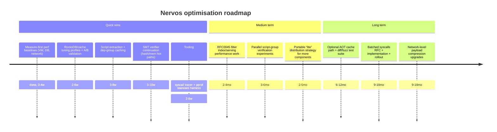

# Optimisation opportunities across the ecosystem

## Executive summary

This report identifies performance and portability optimisation opportunities across the Nervos ecosystem, focusing on **CKB full nodes**, **CKB-VM execution**, **Molecule serialization**, **SMT/Merkle proof verification**, **storage (RocksDB and caches)**, **networking/sync**, and **light clients**. It synthesises primary sources (RFCs, official docs, core repositories) and proposes concrete engineering work with impacts, risks, and validation benchmarks. citeturn5view0turn4view2turn4view3turn15view0turn14view0

The single most important constraint is that **CKB’s per-block computation is consensus-bounded by cycles** (the `max_block_cycles` limit), with explicit charging rules for VM instructions and syscalls. This means many optimisations are about **node throughput and latency** (keeping up with blocks, mempool pressure, faster syncing and query paths) rather than raising the on-chain theoretical maximum. Nevertheless, faster verification and IO directly improves real-world reliability, CPU headroom, and the feasibility of running nodes/light clients on constrained devices. citeturn4view2turn5view1turn5view2turn8view0

Top “quick wins” (weeks) with high expected ROI:
- **RocksDB and cache tuning at the node level** (block cache sizing, write-buffer/compaction tuning, workload-specific options files) and **measuring hot access patterns** first. citeturn8view0turn8view1turn8view2  
- **Script verification hot-path profiling and caching of extracted scripts (code bytes) and resolved dep-group expansions** to reduce repeated IO and hashing across mempool/block verification. Entry points exist in `ckb/script/src/verify.rs` where groups are iterated, scripts extracted, and schedulers created. citeturn25view0turn5view0turn5view2  
- **SMT proof verifier micro-optimisation continuation** (especially hashing and memory operations), following the demonstrated “bench-optimize” work that reduced proof verification cycles by ~75%. citeturn23view0  
- **Light client portability pattern replication** (dependency slimming, storage backend selection): your `ckb-light-client-lite` shows large disk reductions by swapping RocksDB → SQLite and using static musl builds while keeping protocol compatibility, indicating similar “portability-first builds” can be systematically provided for other components. citeturn22view0turn9search5  

Medium-term (months) opportunities with potentially large node-side gains:
- **Optional on-node AOT/JIT compilation and caching** for hot scripts (system scripts and ubiquitous lock/type scripts), leveraging existing CKB-VM “ASM mode” and separate AOT efforts; careful cycle-model consistency and sandboxing are required. citeturn4view9turn16search0turn4view2turn4view0  
- **Host-level parallelism improvements**: CKB already parallelises verification across transactions at the host level, but within-transaction script group execution is sequential; introducing safe parallel verification of independent script groups (with deterministic result aggregation) is a candidate. citeturn5view1turn5view0turn25view0  
- **Protocol-level batching** (Merkle proofs, filters, syscall patterns) to reduce overheads like syscall base costs (500 cycles) and repeated loads. Some of this requires hardfork/RFC work if it changes syscalls or consensus-visible behaviour. citeturn4view2turn4view3turn14view0turn15view0  

Long-term (quarters+) bets:
- **A more aggressive VM execution engine roadmap** (AOT for more architectures, deeper trace/dispatch optimisation, tighter memory models) while maintaining determinism and stable cycle accounting. citeturn17search1turn4view0turn4view2turn16search0  
- **Network payload reduction** (witness/transaction component compression and deduplication, more efficient block relay paths) in ways that preserve DoS resistance and peer scoring/ban strategies. citeturn4view6turn20view4turn14view0turn21view1turn21view0  

## Baseline architecture and known performance pressure points

CKB transaction verification is built around the Cell model and scripts: **lock scripts run for input cells**, **type scripts run for inputs and outputs**, and a key optimisation already present is **script grouping**—inputs (and type-bearing inputs/outputs) are grouped by script hash and the same script runs **once per group**, not once per cell. This reduces repeated execution, but also concentrates performance pressure into “hot” scripts that dominate network usage (notably signature checks and common token scripts). citeturn5view0turn5view1

A transaction validation lifecycle (simplified) is: **resolve inputs/ deps**, then **verify** structural rules (size limits, since rules, etc.), then **execute scripts in CKB-VM** and obtain consumed cycles; the transaction is broadcast along with the cycles value, and peers will re-check that the claimed cycles match actual execution. citeturn5view2turn4view2turn5view1

The VM cost model is explicit and consensus-critical:
- A consensus field `max_block_cycles` caps total script cycles per block. citeturn4view2  
- Instruction cycle costs are mostly 1 cycle, but some branches, loads/stores, and MUL/DIV cost more; syscalls and `ECALL/EBREAK` are charged heavily (base 500 cycles), and data movement is charged per byte (0.25 cycles/byte) during initial loading and syscalls. citeturn4view2turn4view3  
- Syscalls use a **partial loading** interface (`addr`, `len`, `offset`) to limit unnecessary copying and allow callers to fetch only what they need. citeturn4view3turn18view0  

Those constraints imply that “performance work” splits into two categories:
- **Consensus-visible efficiency**: reduce compute cycles used by common on-chain workloads (e.g., better cryptographic libraries, better proof verification algorithms, fewer syscalls, smaller binaries). citeturn4view2turn23view0turn6view0  
- **Node-side throughput/latency**: reduce wall-clock time per cycle consumed, improve IO, caching, parallelism, and reduce network/DB overhead, so nodes can validate and sync faster even when blocks approach cycle limits. citeturn8view0turn25view0turn4view9  

A useful way to visualise the end-to-end “critical path” for full nodes is:

This pipeline highlights where optimisations tend to pay off: resolution & dep fetching, script code extraction, VM execution dispatch, syscall overhead, and store/index updates. citeturn5view2turn5view0turn25view0turn4view2

## VM execution and syscall layer

### Current state

CKB-VM is a RISC‑V VM used for running verification scripts. In the main CKB-VM repo, there are at least **two execution modes**: a Rust interpreter and an assembly-based interpreter (“ASM mode”), and the project notes that ASM mode is used for production consistency. citeturn4view9

CKB-VM’s design explicitly addresses memory safety and optimisation feasibility via **W^X (write xor execute)**. The VM divides memory into 4KB pages; pages are either writable or executable (not both), and page faults occur on invalid execution/write attempts. The RFC notes this also enables building JIT or AOT solutions more easily. citeturn4view0turn16search1

The VM has multiple memory backends surfaced in its APIs, including `FlatMemory`, `SparseMemory`, and `WXorXMemory`, and it exposes a `TraceMachine` and a cost model module in its public API surface (per docs.rs). This suggests the platform already supports alternate execution/memory trade-offs and tracing hooks that can be exploited for optimisation and profiling. citeturn17search1

Syscalls are a major performance and cycle-accounting boundary:
- Syscalls are used to read transaction and chain data from the host into VM memory while preserving a standard RISC‑V implementation. citeturn4view3  
- Syscalls use partial loading, and cycle rules charge a 500-cycle base plus per-byte costs. citeturn4view2turn4view3  
- The syscall set (and versions) is evolving: e.g., VM version/current cycles/exec syscalls (CKB2021 era) and process-like spawn/pipe/read/write/wait (Meepo hardfork era) introduce richer execution patterns and scheduling considerations (including a limit of 4 instantiated VMs and expensive switching). citeturn4view4turn4view5  

Finally, there are already parallelism hooks *around* VM execution: CKB’s verification environment runs each transaction separately, and the host can verify multiple transactions in parallel; however, within VM there is no multithreading, and script groups for a transaction execute sequentially. citeturn5view1turn25view0

### Concrete optimisation proposals

The table below enumerates VM- and syscall-focused proposals with impact ranges, effort, risks, benchmarks, and likely code entry points.

| Proposal | What to optimise | Est. impact | Complexity | Key risks / trade-offs | Benchmarks to validate | Suggested entry points |
|---|---|---:|---|---|---|---|
| Reduce syscall crossing overhead (host side) | Optimise partial-loading implementation: buffer reuse, fewer copies, avoid repeated serialization for common syscalls like `load_*_by_field` | 5–25% wall-clock verification speedup on syscall-heavy scripts (node-side) | Medium | Must preserve exact semantics and determinism; risk of subtle bugs in offset/len handling | Microbench per syscall (bytes/sec), end-to-end tx verification on common scripts; compare cycle==same, time<baseline | `ckb/script/src/verify.rs` scheduler + syscall generator plumbing; syscall implementations from RFC set citeturn25view0turn4view3turn18view0 |
| Add *batched* syscalls (new syscall IDs) | Reduce syscall count by allowing “load N fields” or “load N cell data slices” in one call | Potentially large for some workloads (10–40% fewer cycles if it meaningfully reduces syscall base charges) | High (consensus/RFC) | Requires RFC + deployment; must define cycle charges fairly; increases syscall surface area | Synthetic “N small loads” benchmark measuring cycles and time vs many single syscalls | RFC process + syscall RFC family (`0009`, `0034`, `0050`) citeturn4view2turn4view3turn4view4turn4view5 |
| VM dispatch optimisation in ASM mode | Super-instructionisation, better branch prediction layout, trace/dispatch improvements, reduce per-instruction overhead | 10–30% VM speedup on instruction-heavy scripts (node-side) | High | Architecture-specific complexity; greater maintenance burden; must keep behaviour consistent across modes | `ckb-vm` instruction microbench; real script suites (secp lock, xUDT-like, SMT verify) | `ckb-vm` ASM mode; trace/cost_model modules exposed in API citeturn4view9turn17search1 |
| Heuristic memory backend selection | Choose flat vs sparse vs WXorX based on script profile (size of address space touched, memory write patterns) | 5–15% for memory-intensive scripts (node-side) | Medium | Wrong heuristic can regress; needs good telemetry | Compare same script under each backend; vary memory footprint; measure time and peak RSS | `ckb_vm::memory::{flat,sparse,wxorx}` API surface citeturn17search1turn4view0 |
| Optional AOT compilation cache for hot scripts | Cache native compiled execution for common code_hashes using existing AOT work (dynasm/LLVM-based), while keeping cycle accounting stable | 1.5–10× speedup for hot scripts on supported hosts (node-side) | High | Sandboxing, correctness parity, architecture coverage; operational complexity; avoid consensus-visible divergence | Compare interpreter vs AOT across a corpus, require identical results and cycle counts; fuzz differential testing | `ckb-vm-aot` project + W^X rationale; cycle rules from RFC0014 citeturn16search0turn4view0turn4view2 |
| Syscall-aware “fast paths” for common patterns | Optimise host implementations of common syscalls by caching computed tx hash/script hash and avoiding recomputation within one verification | Low–medium (depends on workload; helps syscall-heavy verification) | Low–Medium | Must respect per-call charging model; ensure cache is per-run and isolated | Measure repeated `ckb_load_tx_hash`/`ckb_load_script_hash` loads in stress test | Syscall summary and VM cycle rules citeturn18view0turn4view2 |

### Notes on cycle metering and “what is safe”

Because the cycle schedule is both explicit and security-relevant, VM speedups must preserve two invariants: (1) identical program behaviour and (2) identical cycle accounting per instruction/syscall as defined by consensus rules. The cycle rules explicitly reference hardware-based instruction costs and benchmark-derived syscall costs, which implies that future changes require careful measurement and potentially hardfork coordination if cycle tables change. citeturn4view2turn4view1turn4view3

The spawn/process syscalls introduce a different optimisation surface: rather than many repeated exec-style checks, contracts could be structured into smaller cooperating programs; but RFC0050 warns that VM instantiation switching is expensive and developers should keep processes below the “instantiated VM” cap to avoid overhead. This is both a **developer ergonomics** and **system performance** story: better tooling and libraries can make the efficient patterns easy by default. citeturn4view5turn18view0

## Script execution model and encoding

### Current state

CKB scripts are organised so that inputs and outputs are grouped by script hash, then executed sequentially by group. The transaction structure RFC explains grouping, code locating via `cell_deps`, and the special “group sources” (`CKB_SOURCE_GROUP_INPUT` / `CKB_SOURCE_GROUP_OUTPUT`) used by syscalls so a single script run can validate multiple cells. citeturn5view0turn5view1turn18view0

Dep Groups are an explicit dependency-dedup mechanism: a dep group cell can bundle multiple cell deps, expanded before code locating and execution. This reduces transaction construction overhead but adds expansion/reading overhead at verification time. citeturn5view0

At the implementation level, transaction script verification in the CKB repo iterates script groups and runs each group with a scheduler, producing consumed cycles. The same module includes “resumable” verification variants (including async signalling) and special-cases the built-in Type ID system script to avoid starting the VM. This file is a key entry point for caching and parallelism experiments. citeturn25view0turn5view1

On encoding: CKB uses **Molecule** and JSON; Molecule is the core format defining “nearly all structures in CKB”, and the official docs highlight **canonicalisation**, **partial reading/self-contained substructures**, and **zero-copy** properties. The serialization RFC also explicitly calls Molecule a canonicalisation + zero-copy format and uses it broadly across core structures. citeturn6view0turn4view7turn6view2

The Molecule ecosystem includes Rust/C generators and explicit guidance for `no_std` use in scripts; later Molecule versions require careful feature selection (e.g., `bytes_vec`) for compatibility with the CKB runtime. This implies opportunities for performance tuning and smaller binaries by selecting the right features and minimising allocations. citeturn6view2turn4view8turn6view0

### Concrete optimisation proposals

| Proposal | What to optimise | Est. impact | Complexity | Key risks / trade-offs | Benchmarks to validate | Suggested entry points |
|---|---|---:|---|---|---|---|
| Cache extracted script binaries by `code_hash` | Avoid repeated cell-dep reads and hashing when the same code is used across many txs | 5–30% verification wall-clock reduction under mempool load (node-side) | Medium | Memory pressure; must invalidate on reorg/state changes; be careful with “Type hash” upgradeable scripts | Mempool replay of common script sets; measure DB reads and total verify time | `extract_script()` shows explicit extraction hook in verifier citeturn25view0turn5view0 |
| Dep Group expansion memoisation | Cache dep-group membership expansion (OutPoints) keyed by dep-group outpoint, reuse across txs | Low–medium (depends on dep-group prevalence) | Low–Medium | Must detect when dep-group cell changes (spent/updated); reorg invalidation | Benchmark txs using common dep groups (e.g., shared system libs), compare verifier IO | Dep group semantics described in transaction RFC citeturn5view0turn25view0 |
| Host-level parallel verification of independent script groups | Run groups concurrently where safe; aggregate results deterministically | 1.2–2× speedup for “multi-group” txs on multicore (node-side) | High | Determinism in error reporting; shared caches and IO must be thread-safe; manage cycle limits per group | Synthetic tx with many independent groups; real mempool trace re-verification | Group loop in verifier is explicit; host already parallelises across txs citeturn25view0turn5view1 |
| Pre-serialised or zero-copy Molecule views for hot structures | Reduce allocations and copies when decoding tx/block/headers and when constructing syscall outputs | 5–20% in encoding-heavy paths (node-side, indexers, networking) | Medium | Requires careful lifetime management; complicated across language boundaries | Bench decode of blocks/txs at various sizes; profile allocation counts | Molecule “partial reading” and “zero-copy” are first-class goals citeturn6view0turn4view7turn5view2 |
| Hash reuse across lifecycle steps | Avoid recomputing tx hashes/script hashes/data hashes within a verification pipeline | Low–medium (depends on hot hashing sites) | Low | Needs careful cache scoping and invalidation; avoid hidden coupling | Verify pipeline benchmark: count hash computations; measure instruction cache and time | Syscalls include “load tx hash/script hash” operations; lifecycle includes size/hash checks citeturn18view0turn5view2turn4view3 |
| Contract binary size reduction toolchain defaults | Promote stripping/LTO and shared libraries to reduce ELF load size (0.25 cycles/byte) | Direct on-chain cycle reduction for large binaries; also improved distribution | Medium | Tooling complexity; must preserve determinism; sometimes larger code is faster (trade-off) | Measure cycles to load + run for scripted workloads; compare size vs runtime | Load-cycle charging is explicit; RFC0003 discusses shared libraries/bootloader for smaller contracts citeturn4view2turn4view0 |

### Practical guidance: target syscall counts, not only instruction counts

Because each syscall includes a large fixed cycle charge (500 cycles) plus per-byte cost, many on-chain performance wins come from:
- using “by-field” syscalls instead of serialising full objects, and  
- reducing the number of syscalls by restructuring code to load larger contiguous slices less frequently. citeturn4view2turn18view0turn4view3  

A coherent optimisation program should therefore maintain (a) **per-script syscall profiles**, (b) **bytes moved across syscalls**, and (c) **VM instruction mix**, and treat them as first-class regression metrics. The existing tooling ecosystem (syscall tracer, pprof tools) provides building blocks to make this systematic. citeturn19search15turn19search1turn18view0  

## Storage and Merkle structures

### Current state

On the storage side, CKB’s node config makes it explicit that the DB is **RocksDB**, with a configurable block cache (`cache_size`) and an external options file used to tune RocksDB for the workload. The default options file exposes compaction and write-buffer parameters (e.g., `max_background_jobs`, `level_compaction_dynamic_level_bytes`, `write_buffer_size`). citeturn8view0turn8view1

There is also a dedicated wrapper/stack around RocksDB in the ecosystem (`ckb-rocksdb`), positioned as a “high-performance RocksDB wrapper tailored for Nervos CKB” and built with a statically linked RocksDB plus selectable compression features. citeturn8view2

CKB additionally uses explicit in-memory caches for chain and cell-related data (`header_cache_size`, `cell_data_cache_size`, etc.) in its configuration, which indicates “hot data” caching is already part of its performance approach and can be extended/tuned. citeturn24search1

On Merkle structures:
- **Light clients** rely on **Merkle Mountain Range (MMR)** and FlyClient-style sampling (RFC0044). citeturn15view0turn10search15  
- The **Sparse Merkle Tree** library (`sparse-merkle-tree`) is described as an “optimised sparse merkle tree”, supports multi-leaf proofs, is backend-agnostic, and supports `no_std`. It explicitly highlights a build-time choice between a performant C backend hash (`blake2b-rs`) and a more portable Rust implementation (`blake2b-ref`). citeturn7view0  
- The linked “bench-optimize” context document shows a real on-chain verification benchmark in CKB RISC‑V VM for SMT proof verification, identifies **hashing and proof opcode interpretation** as the hot path, and documents an improvement from ~6994 K cycles to ~1703 K cycles (~75.7%). citeturn23view0  

### Concrete optimisation proposals

| Proposal | What to optimise | Est. impact | Complexity | Key risks / trade-offs | Benchmarks to validate | Suggested entry points |
|---|---|---:|---|---|---|---|
| Workload-specific RocksDB options profiles | Tune block cache, compaction, write buffers for CKB access patterns; consider separate CF options per data family | 10–40% node IO improvement in sync/reorg-heavy workloads (varies widely) | Medium | Mis-tuning can degrade tail latency; requires careful measurement on real hardware | Sync-from-scratch benchmarks; fork/reorg simulation; measure read amplification and WAL/compaction stats | `resource/ckb.toml` DB section + `default.db-options`; `ckb-rocksdb` stack citeturn8view0turn8view1turn8view2 |
| Hot cell / header cache redesign | Adjust cache sizing and eviction to match access locality; unify caches; add admission control | Low–medium (depends on workload; may reduce DB reads significantly) | Medium | Memory growth; subtle cache invalidation on reorg | Replay mainnet blocks; measure cache hit rates and DB reads | Cache knobs appear in config; verification pipeline repeatedly reads headers/cells citeturn24search1turn5view2turn25view0 |
| SMT verifier: continue blake2b + memcpy/memset micro-opts | Extend remaining “direct buf write” patterns, reduce branching in proof parsing, consider RISC‑V-friendly hash specialisation | Further 5–20% cycle reduction on SMT verify (if remaining hotspots exist) | Medium | Security: avoid unsafe “optimisations” (e.g., removing checks that are actually required); maintainability of C header | Continue the same benchmark harness (131072 keys, 40 leaves) and add broader parameter sweeps | `sparse-merkle-tree` C verifier (`c/ckb_smt.h`) as described in bench context citeturn23view0turn7view0 |
| Protocol-level proof batching & multi-leaf proofs by default | Design higher-level protocols to use multi-leaf existence/non-existence proofs and batch verification | Can be large in applications (fewer proofs, fewer hashes) | Medium–High (depends on protocol adoption) | Complexity in proof generators; increased proof size variance; UX complexity | App-level benchmarks: multi-asset updates, rollups, bridging proofs | SMT library explicitly supports multi-leaf proofs citeturn7view0turn23view0 |
| Persist deterministic block filters for light clients efficiently | When supporting RFC0045, store filters as an index with efficient retrieval; avoid on-demand generation (DoS risk) | Improves server throughput and light-client UX; reduces CPU spikes | Medium | Disk growth; must handle reindex cases; privacy considerations | Full-node “serve filters” benchmarks: QPS, IO per request, rebuild time | RFC0045 explicitly recommends persisting filters and not generating on demand citeturn14view0turn24search1 |

### A key synthesis: prove where cycles go for “Merkle-heavy” workloads

The SMT optimisation notes show that in a RISC‑V VM environment, **hash compression and memory movement dominate**, and very small changes (specialised memcpy, skipping redundant zeroing, direct buffer writes) can yield substantial cycle savings. This pattern likely generalises to other on-chain primitives (signature verification helpers, proof verifiers, codecs): when the workload is “tight loops of hashing and small copies,” micro-architectural considerations inside the VM matter disproportionately. citeturn23view0turn7view0turn4view2  

## Networking, sync, and light clients

### Current state

CKB’s block synchronisation protocol specifies staged sync (headers-first style) and includes **Compact Block** as a technique to compress and transfer blocks based on the assumption that peers already have many transactions in mempools; compact blocks include txids and only transmit transactions predicted unknown. citeturn4view6turn5view2

The network stack also includes:
- A **node discovery protocol** that uses DNS seeds and hard-coded seeds, uses `multiaddr`, and imposes rules about valid multiaddr formats; it also uses Molecule for message serialization. citeturn21view0  
- A P2P hardfork upgrade strategy (ckb2021) that updates protocol versions and includes specific sync request list limit changes (e.g., from 16 to 32) and codec simplification, indicating the protocol layer is already an optimisation surface that evolves with hardforks. citeturn21view2  
- Transaction/filtering mechanisms: an older Transaction Filter Protocol uses Bloom filters to reduce data sent to low-capacity peers, and a newer Client Side Block Filter protocol (RFC0045) uses deterministic Golomb-coded set filters (BIP158 parameters) over lock/type script hashes, explicitly recommending persistent filter storage and warning against dynamic generation due to DoS risk. citeturn20view4turn14view0  

Light clients:
- RFC0044 introduces a FlyClient-based light client protocol using MMR and sampling tailored for NC‑Max difficulty adjustment, requiring only logarithmic headers and storing only a single header between executions. citeturn15view0turn10search15  
- The official light client reference implementation is explicitly based on RFC0044 and RFC0045 and includes wasm support. citeturn9search5turn14view0turn15view0  
- Your `ckb-light-client-lite` demonstrates practical portability improvements: static musl builds and a SQLite backend replacing RocksDB, with a published benchmark showing major disk reduction after 60 seconds of sync and lower RSS, while keeping protocol compatibility. citeturn22view0turn9search5  

### Concrete optimisation proposals

| Proposal | What to optimise | Est. impact | Complexity | Key risks / trade-offs | Benchmarks to validate | Suggested entry points |
|---|---|---:|---|---|---|---|
| Compact block relay robustness & reconciliation | Improve short-id collision handling, request/response batching, and mempool reconciliation to reduce fallback full-tx transfers | Medium (bandwidth + latency) | Medium–High | Protocol complexity; must maintain DoS resistance | Simulated network with varying mempool overlap; measure propagation time and bytes | Block sync RFC includes compact blocks; relay protocols listed in node config citeturn4view6turn24search1 |
| Witness compression / deduplication in P2P | Compress large witness/tx payloads and deduplicate repeated segments where safe | Medium–High bandwidth reduction on some workloads | Medium–High | CPU cost vs bandwidth; privacy considerations; compatibility across versions | Replay blocks with large witnesses; measure bytes on wire, CPU cost | Network config and protocol upgrade RFC show evolving network protocols citeturn24search1turn21view2turn5view0 |
| “Portability builds” as a first-class release target | Provide official static builds and lighter DB backends (SQLite) for light clients and some tooling, guided by your approach | High for adoption on embedded/mobile; moderate perf impact | Low–Medium | Feature parity; DB durability; maintaining multiple build matrices | Cross-device sync tests; measure disk/RSS/CPU on constrained hardware | Light client docs note WASM/resource-constrained targets; your repo gives concrete build recipe/results citeturn10search15turn22view0turn15view0 |
| Efficient server-side filter index serving | Implement RFC0045 filter persistence with efficient storage format and parallel range serving | Medium | Medium | Disk growth; reindex time; peers serving inconsistent filters | Filter serving throughput benchmark and rebuild benchmark | RFC0045 Node Operation section is explicit about persistence and reindex-on-start behaviour citeturn14view0 |
| Discovery & peer management tuning | Improve peer selection/eviction and seed strategies; ensure multiaddr correctness and reduce bootstrap time | Low–Medium | Medium | Network behaviour changes can introduce partition risk if mis-tuned | Large-scale simulation; bootstrap time distribution; peer diversity metrics | Discovery protocol requirements for DNS+seed strategy are explicit citeturn21view0turn24search1 |

### Light client mode design: combine RFC0044 sampling + RFC0045 filters strategically

A pragmatic performance/security architecture is:
1) Use RFC0044 sampling (FlyClient + MMR) to establish a trusted header chain tip with minimal storage/bandwidth. citeturn15view0turn10search15  
2) Use RFC0045 deterministic block filters (served by full nodes) to decide which blocks to fetch in full for watched scripts, verifying filter hashes and interrogating peers on disagreement. citeturn14view0  
3) Use “portability builds” (SQLite/static builds, WASM) to make the above usable on constrained platforms without weakening cryptographic guarantees. citeturn22view0turn9search5turn10search15  

This layered approach aligns with the explicit motivations of the RFCs: reduce linear header storage, minimise bandwidth, avoid trusting full nodes more than necessary, and avoid asymmetric “generate on demand” costs that enable DoS. citeturn15view0turn14view0  

## Prioritised roadmap and benchmark strategy

### Cross-area proposal comparison: impact vs effort

The following table compresses the most actionable proposals into an “impact vs effort” view. (Impact is a blend of node-side throughput, user-perceived latency, and—in some cases—on-chain cycle reduction where applicable.)

| Priority bucket | Proposal | Component(s) | Impact | Effort | Consensus / RFC dependency |
|---|---|---|---|---|---|
| Quick wins | RocksDB + cache tuning profiles and measurement-first approach | CKB node storage | High (often 10–40% IO improvement) | Medium | No citeturn8view0turn8view1 |
| Quick wins | Cache extracted scripts by `code_hash` + dep-group expansion memoisation | Script verification | Medium–High | Medium | No citeturn25view0turn5view0 |
| Quick wins | Continue SMT verifier micro-optimisations following bench-opt work | SMT / on-chain libs | Medium (cycle reduction) | Medium | No (library-level) citeturn23view0turn7view0 |
| Quick wins | Standardise profiling harness (pprof, syscall tracing) and publish performance dashboards | Tooling | Medium | Low–Medium | No citeturn19search1turn19search15 |
| Medium | Efficient RFC0045 server-side filter indexing and serving | Full nodes + light clients | Medium | Medium | No (optional protocol support) citeturn14view0 |
| Medium | Host-level parallel verification of script groups (where safe) | Script verification | Medium–High | High | No (implementation choice), but needs careful determinism policy citeturn25view0turn5view1 |
| Medium | Optional AOT cache for hot scripts (node-side), differential tested | CKB-VM execution | High (node-side) | High | No (if optional), but must preserve cycle accounting citeturn16search0turn4view2 |
| Long-term | Batched syscalls / new syscall IDs for common fetch patterns | VM/syscalls | Potentially high (cycle + time) | High | Yes (RFC + deployment) citeturn4view2turn4view3 |
| Long-term | Network payload reduction: witness compression/dedup + compact block refinement | Networking/sync | Medium–High | High | Possibly (protocol versioning) citeturn21view2turn4view6 |

### Recommended roadmap

### Benchmark suite: what to measure to avoid “optimising blind”

A rigorous optimisation program needs benchmarks at three layers, each with clear pass/fail invariants:

**VM-level microbenchmarks**
- Instruction throughput and dispatch overhead in ASM mode vs alternatives; ensure functional equivalence (differential tests). citeturn4view9turn17search1  
- Syscall throughput: bytes copied/sec per syscall, number of syscalls per common script, and the relationship between wall-clock time and charged cycles (especially important given the 500-cycle syscall base and 0.25 cycles/byte rules). citeturn4view2turn4view3turn18view0  

**Script/workload benchmarks**
- “Common scripts corpus”: representative lock/type scripts, plus Merkle and cryptography-heavy contracts, executed under `ckb-debugger` / standalone debugger tooling with cycle and time measurements. citeturn19search1turn5view1turn23view0  
- SMT benchmark parameter sweeps extending the bench-opt context: number of keys, leaves, proof shape, hash backend selection. citeturn23view0turn7view0  

**Node end-to-end benchmarks**
- Sync-from-scratch and steady-state block processing at varying DB cache sizes and options files; record compaction stats, WAL behaviour, and end-to-end time. citeturn8view0turn8view1  
- Light client benchmarks in multiple modes (RFC0044-only header sampling vs RFC0044+RFC0045 filters), including storage growth, reconnect behaviour, and peer disagreement handling. citeturn15view0turn14view0turn9search5  
- Portability builds baseline: compare RocksDB vs SQLite backends and dynamic vs static builds on constrained devices (your published methodology is a good template). citeturn22view0turn10search15  

### Suggested code-level entry points for inspection

These are the most useful entry points surfaced directly by official repos/docs (paths may move across versions):

- **Transaction script verification orchestration**: `ckb/script/src/verify.rs` (group loop, script extraction, scheduler creation, resumable verification) citeturn25view0  
- **Node config for DB, network protocols, caches, metrics hooks**: `ckb/resource/ckb.toml` and `ckb/resource/default.db-options` citeturn24search1turn8view1  
- **CKB-VM execution modes and memory backends**: `ckb-vm` repo (ASM vs Rust modes) + public API modules (`FlatMemory`, `SparseMemory`, `WXorXMemory`, `TraceMachine`) citeturn4view9turn17search1turn4view0  
- **Syscall specs and evolution**: RFC0009 / RFC0034 / RFC0050 (and RFC0046 summary table) citeturn4view3turn4view4turn4view5turn18view0  
- **Light client protocol + filters**: RFC0044 + RFC0045, plus `nervosnetwork/ckb-light-client` reference implementation citeturn15view0turn14view0turn9search5  
- **SMT proof verification hot path**: `sparse-merkle-tree` (C verifier) with the bench-opt context explicitly pointing to `smt_calculate_root()` and `_smt_merge()` as hotspots citeturn23view0turn7view0  
- **Profiling/debug tooling**: `ckb-standalone-debugger` tool suite (pprof/signal profiler) and `ckb-vm-contrib` (syscall tracer, size analyser, fuzzing utils) citeturn19search1turn19search15  

![[Optimisation opportunities across the entity["organization","Nervos Network","blockchain ecosystem.pdf]]
